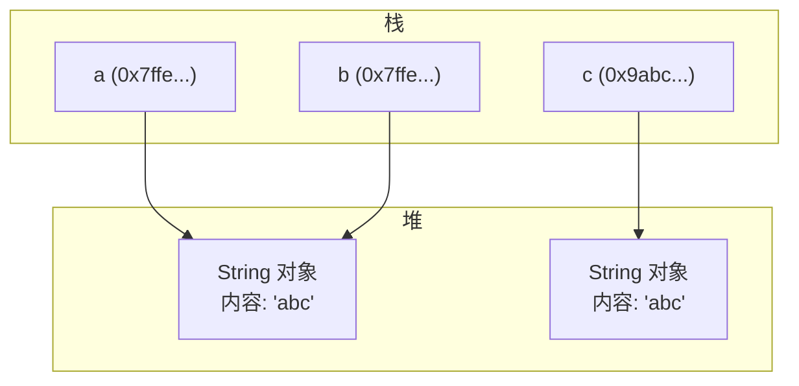
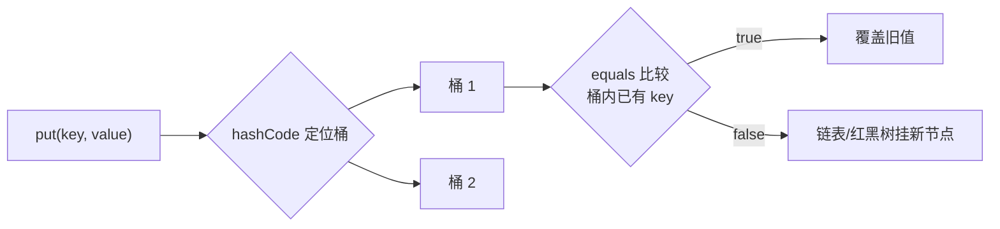
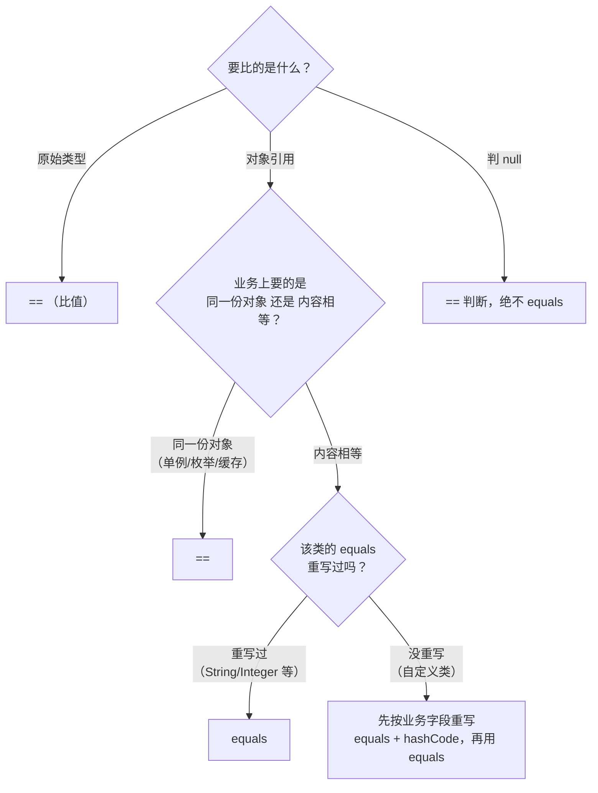

# == 和 equals 到底比的是什么？被新同事的"甩锅代码"坑过以后

## 先说我那次线上事故

接手一个老项目第一周，测试就甩过来一个 bug：用户改了昵称，列表页刷新后**偶尔**还是旧值。我打开缓存那块代码，看到这样一段：

```java
// 伪代码：判断缓存里的值是否和数据库一致
if (cacheUser.getName() == dbUser.getName()) {
    // 认为没变化，不更新缓存
    return;
}
```

用 `==` 比较字符串！当两个 `name` 是同一个字符串字面量时（JVM 字符串常量池兜底），`==` 碰巧返回 true，缓存不更新；一旦 name 是运行期拼出来的新字符串，`==` 就返回 false，缓存被频繁重建。**同一份代码，行为全看 JVM 心情。** 这就是面试官拿 `==` 和 `equals` 当开场白的原因——它俩混用造成的 bug，是生产环境里最常见的低级事故。

## 它俩到底比的是什么？

一句话版本：

> `==` 比较的是**引用**（栈上的地址），`equals` 比较的是**内容**（由类自己定义"怎么算相等"）。

用图看内存，一遍就懂：



对应代码：

```java
String a = "abc";                        // 字符串常量池里的字面量
String b = "abc";                        // 常量池已有，直接复用同一个对象
String c = new String("abc");            // 强制 new 一个新的堆对象

System.out.println(a == b);              // true  : 引用相同，指向池里同一个对象
System.out.println(a == c);              // false : 引用不同，地址不一样
System.out.println(a.equals(c));         // true  : String 重写了 equals，比内容
```

> 记法：`==` 是"我们是不是同一个人"，`equals` 是"我们是不是长得一样"。

## equals 的默认行为：不重写就是 ==

这是最容易忽略的一层。`Object.equals()` 的默认实现**就是引用比较**，String、Integer 这些类之所以能比内容，是因为它们各自重写了 `equals`。

```java
public class User {
    private String name;

    // 没重写 equals —— 两个 name 相同的 User 对象，equals 依然 false
}

User u1 = new User("张三");
User u2 = new User("张三");
System.out.println(u1.equals(u2));   // false，因为走的是 Object 默认的 ==
```

面试追问到这里，就该引出**重写 equals 必须同时重写 hashCode** 的黄金规则：

- HashMap/HashSet 先用 hashCode 定位桶，再用 equals 判断桶内是否相等
- 只重写 equals 不重写 hashCode → 同一个对象在不同 hashCode 下进不同桶 → 集合里出现"重复"元素、get 取不到值



```java
@Override
public boolean equals(Object o) {
    if (this == o) return true;                 // 引用相同，直接相等，短路
    if (o == null || getClass() != o.getClass()) return false; // 类型不同直接不等
    User user = (User) o;
    return Objects.equals(name, user.name);     // 字段逐个比，Objects.equals 防 NPE
}

@Override
public int hashCode() {
    return Objects.hash(name);                  // 和 equals 用同一组字段
}
```

> 规则只有一条：**equals 用哪些字段，hashCode 就用哪些字段。** 两者字段不一致，集合类立刻给你挖坑。

## 那些年我们踩过的 == 坑

我整理了一份踩坑清单，基本覆盖面试官爱挖的点：

| 场景                     | 现象                                               | 真相                                                          |
| ------------------------ | -------------------------------------------------- | ------------------------------------------------------------- |
| `Integer` 用 `==`        | `Integer a = 127; Integer b = 127; a == b` 为 true | 缓存池 -128~127，超出就 false                                 |
| `Long`、`Short` 同理     | 两个对象在池内 `==` true，池外 false               | 自动装箱复用了缓存对象                                        |
| `BigDecimal` 用 `equals` | `1.0.equals(1.00)` 为 false                        | BigDecimal equals 连精度一起比，要用 `compareTo`              |
| `String` 判空            | `s == ""` 判断空串                                 | 应改用 `s.isEmpty()`，`==` 只在对象是常量池那个字面量时才成立 |
| 枚举用 `==`              | 枚举 `==` 和 equals 等价                           | 枚举是单例，`==` 反而是推荐写法，语义更清晰                   |

`BigDecimal` 那条是高频面试题，展开一下：

```java
BigDecimal a = new BigDecimal("1.0");
BigDecimal b = new BigDecimal("1.00");

System.out.println(a.equals(b));   // false！equals 比较数值+精度（scale）
System.out.println(a.compareTo(b));// 0    compareTo 只比数值大小
```

> 面试加分句：**"BigDecimal 的 equals 连精度一起比，所以做金额比较永远用 compareTo，否则 1.0 和 1.00 会被判成不相等。"** 这句话一出口，面试官就知道你真用 BigDecimal 算过钱。

## 什么时候用 ==，什么时候用 equals？

| 比较目标                               | 用什么                | 为什么                                      |
| -------------------------------------- | --------------------- | ------------------------------------------- |
| 原始类型 int/long/boolean              | `==`                  | 没有对象，只有值，equals 不存在             |
| 对象引用是不是同一个（单例/缓存/枚举） | `==`                  | 你要比的就是地址本身                        |
| 判 null                                | `==`                  | equals 一调用就 NPE，`obj == null` 才是对的 |
| 枚举比较                               | `==`（推荐）          | 枚举单例，`==` 最稳且语义清晰               |
| 对象内容相等（String/自定义类）        | `equals`              | 比的是业务意义上的相等                      |
| 集合去重 / 作为 key                    | `equals` + `hashCode` | HashMap 查找依赖二者配合                    |

决策树，直接背：



## 最大的坑：手写 equals 忘了 null 处理

最后一个坑，也是 code review 里我卡得最严的一条：**手写 equals 时对参数直接强转、不判 null。**

```java
// 错误写法：传 null 进来直接 NPE，或者误判
@Override
public boolean equals(Object o) {
    User u = (User) o;                    // 传 null → ClassCastException
    return name.equals(u.name);           // name 是 null → NullPointerException
}
```

正确姿势只有两个选择，别自己造轮子：

1. 用 `Objects.equals(field1, field2)` 逐字段比（内部已经处理 null）
2. 直接交给 `record`（Java 16+），编译器帮你生成正确的 equals/hashCode

```java
// record 自动生成基于字段的 equals/hashCode/toString，null 安全
public record User(String name, Integer age) {}
```

> 面试总结陈词模板：**"`==` 比引用、equals 比内容；内容相等语义由类自己定义；重写 equals 必须配 hashCode，字段要一致；涉及 null 和集合场景分别用 Objects.equals 和字段对齐的 hashCode。"** 五句话，覆盖所有追问方向。

## 面试速查清单

- [ ] 能说出 `==` 比引用、equals 比内容的本质，并画出内存图（栈/堆/常量池）
- [ ] 能解释 String 常量池：字面量复用、`new String` 必新对象
- [ ] 知道 `Object.equals` 默认就是 `==`，String/Integer 是重写后的行为
- [ ] 能背出"重写 equals 必须重写 hashCode"，并解释 HashMap 的桶定位流程
- [ ] 知道 Integer 缓存池 -128~127 的边界，能答出 `127 == 127` true、`128 == 128` false
- [ ] 知道 BigDecimal 用 `compareTo` 而不是 `equals`
- [ ] 知道枚举比较推荐 `==`
- [ ] 会写 null 安全的 equals（Objects.equals 或 record）
- [ ] 遇到"equals 和 hashCode 不一致"能说出具体后果（集合重复/取值失败）
