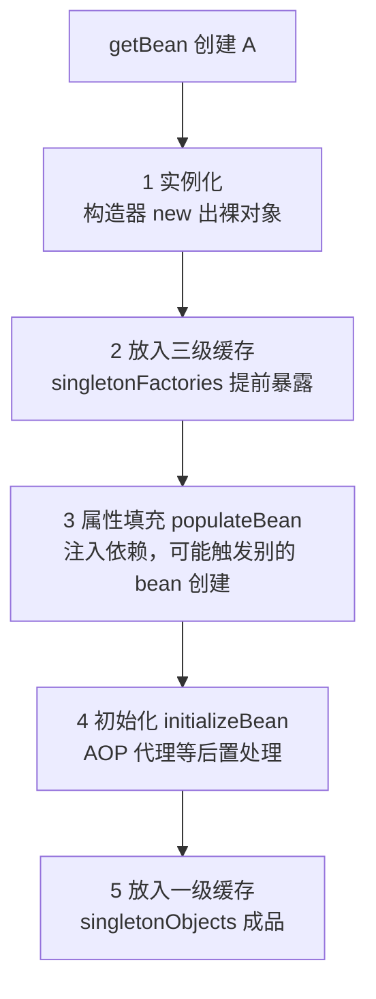
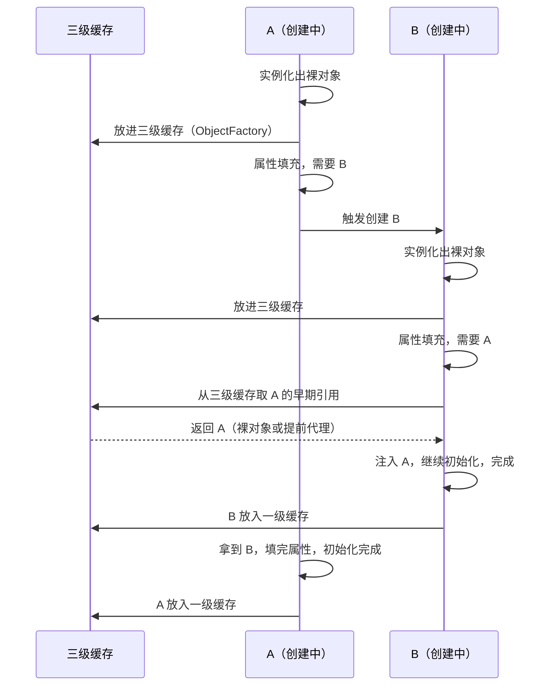

# Spring 循环依赖怎么解决？一张三级缓存图讲透

---

## 先说那次被追问到哑口的面试

面到 Spring 源码环节，面试官抛了个我自认会的问题："两个 Service 互相注入，Spring 怎么处理？"

我脱口而出："用三级缓存。"

"那为什么是三级，不是两级？"

我愣了。当时我只知道"三级缓存 = 三个 Map"，至于为什么非要第三级、构造器注入为什么就崩，完全没想过。后来把 `DefaultSingletonBeanRegistry` 的创建流程啃了一遍，才把这条线串起来。这篇就是按我梳理的顺序记的。

## 面试官考什么？

> 出现频率：Spring 面试必问，十场 Spring 相关至少八场。
> 及格线：能说出"三级缓存 + 默认单例可解决、构造器注入不行"。
> 高分线：能讲清三级缓存的流转过程，以及"为什么是三级不是两级"（AOP 代理时机）。

## 及格回答 vs 高分回答

**及格回答**（背出来的）：

> "Spring 用三级缓存解决循环依赖，三个 Map：singletonObjects、earlySingletonObjects、singletonFactories。构造器注入不行，prototype 不行。"

语法没错，但面试官听完面无表情——这是背的，不是理解的。

**高分回答**（讲出来的）：

> "单例 bean 创建分三步：实例化 → 属性填充 → 初始化。Spring 在'实例化之后、属性填充之前'就把这个 bean 的 ObjectFactory 放进三级缓存提前暴露，这样 A 注入 B、B 又注入 A 时，B 能从缓存里拿到 A 的早期引用继续创建，最后 A 再补完自己的属性。三级缓存的必要性在 AOP：代理默认在初始化阶段生成，如果只用两级缓存、提前暴露裸对象，B 拿到的就是没增强的 A；第三级用 ObjectFactory 把'是否生成代理'推迟到真正被引用那一刻，只有被循环依赖引用的 bean 才走提前代理。构造器注入解决不了，因为构造器阶段 bean 还没进缓存；prototype 不缓存也解决不了；Spring Boot 2.6 起默认禁止循环依赖，需要重构或显式开启。"

区别就一条：及格的人在背三个 Map 的名字，高分的人在讲"对象从裸到成品的过程里，缓存分别扮演什么角色"。

## 先搞懂创建流程，再看缓存

一个单例 bean 的完整创建流程：



关键在第 2 步：**实例化完成、属性还没填的时候，就把对象"预售"出去了**。这就是循环依赖能解开的钥匙——A 填属性要 B，B 填属性要 A，A 已经在缓存里，B 拿到 A 的早期引用继续跑完，回头 A 再补自己的属性。

时序上看得更清楚：



## 三级缓存，每一级干什么

| 缓存 | 名称                    | 存的是什么                              | 什么时候进           |
| ---- | ----------------------- | --------------------------------------- | -------------------- |
| 一级 | `singletonObjects`      | 完整成品 bean                           | 创建完成             |
| 二级 | `earlySingletonObjects` | 早期对象（裸对象或提前代理）            | 从三级缓存取过一次后 |
| 三级 | `singletonFactories`    | `ObjectFactory`（能生成早期引用的工厂） | 实例化后、属性填充前 |

`getSingleton` 的查找顺序：**一级 → 二级 → 三级**。一级没有才看二级，二级没有才从三级"现取现存"：

```java
// DefaultSingletonBeanRegistry.getSingleton 的简化逻辑
protected Object getSingleton(String beanName, boolean allowEarlyReference) {
    Object singleton = this.singletonObjects.get(beanName);        // 1. 一级：成品
    if (singleton == null && this.singletonsCurrentlyInCreation.contains(beanName)) {
        singleton = this.earlySingletonObjects.get(beanName);      // 2. 二级：早期对象
        if (singleton == null && allowEarlyReference) {
            ObjectFactory<?> factory = this.singletonFactories.get(beanName); // 3. 三级：工厂
            if (factory != null) {
                singleton = factory.getObject();                   // 此时才决定要不要代理
                this.earlySingletonObjects.put(beanName, singleton); // 升级到二级
                this.singletonFactories.remove(beanName);          // 移除三级
            }
        }
    }
    return singleton;
}
```

## 为什么是三级，不是两级？

这是这道题的分水岭。表面上看两级就够了：实例化后把裸对象放二级缓存，B 直接拿。

问题出在 **AOP 代理的时机**。Spring 的代理默认在 `initializeBean`（初始化）阶段生成——那时属性都填完了。如果 A 有切面逻辑，它最终应该是**代理对象**；而 B 在属性填充阶段拿到的如果是裸对象，B 手里持有的 A 就没有增强，等 A 初始化完生成代理，B 里还是旧对象，功能直接缺失。

- **两级缓存的方案**：放二级缓存时顺手把代理生成了（提前 AOP）。可行，但所有 bean 只要被提前引用就得先代理一遍——即使它根本没有切面，白白浪费，也和"代理在初始化后生成"的设计冲突。
- **三级缓存的方案**：第三级存的是 `ObjectFactory`，`getObject()` 里才调 `getEarlyBeanReference` 决定是否提前代理。**只有真正被循环依赖引用的 bean 才会走这一步**，没被引用的 bean 从头到尾不产生多余代理。

> 面试可以补一句：三级缓存是"延迟代理"的设计——提前暴露 + 工厂 + 惰性求值，把"要不要代理"的决策推迟到确实需要的那一刻，三者缺一不可。

## 哪些情况解决不了？

| 场景                       | 为什么崩                                                                        | 怎么办                                  |
| -------------------------- | ------------------------------------------------------------------------------- | --------------------------------------- |
| 构造器注入循环依赖         | 构造器阶段 bean 还没进缓存，双方互相要对方 → `BeanCurrentlyInCreationException` | 改 setter/字段注入；或 `@Lazy` 延迟注入 |
| prototype 作用域           | 不缓存、每次新建，没有"提前暴露"这回事                                          | 重构依赖，别让原型 bean 互相依赖        |
| `@Async` 等代理 + 循环依赖 | 提前代理链路复杂，容易出问题                                                    | 拆开依赖或延迟注入                      |
| Spring Boot 2.6+           | 默认 `spring.main.allow-circular-references=false`，启动直接报错                | 重构（推荐）或显式设 `true`             |

其中"为什么构造器注入不行"是追问重灾区：循环依赖的解法依赖"实例化后提前暴露"，而构造器注入发生在**实例化这一步内部**——new A 的时候就要 B，new B 的时候要 A，两边都还没进缓存，无解。

## 三个连环追问 + 应答要点

**追问 1：三级缓存是线程安全的吗？**

> 三个 Map 都是 `ConcurrentHashMap`，创建中的集合也做了同步。加分点：单例创建本身锁在 `synchronized (singletonObjects)` 上，早期引用的读取也在这把锁内。

**追问 2：`@Lazy` 为什么能救构造器循环依赖？**

> `@Lazy` 注入的不是目标对象，而是一个代理占位，真正调用时才去容器取。所以构造器阶段不需要对方真实存在，循环就绕开了。加分点：这说明循环依赖的本质是"创建顺序问题"。

**追问 3：既然默认禁止了，循环依赖是不是坏设计？**

> 是。Spring 团队在 2.6 把默认值改成禁止，就是为了逼大家重构。循环依赖通常是"上帝类"或分层不清的信号。加分点：先看能不能抽公共依赖、拆方法、拆对象，`allow-circular-references=true` 是最后手段。

## 高分回答速记表

| 必答（及格线）                                        | 加分（进决赛）                            | 避雷（说错即减分）                               |
| ----------------------------------------------------- | ----------------------------------------- | ------------------------------------------------ |
| 三个 Map 的名字与查找顺序                             | 完整讲一遍 getSingleton 的流转            | 说"三级缓存存的是对象"——三级存的是 ObjectFactory |
| 默认单例能解，构造器注入不行                          | 讲清三级 vs 二级 = AOP 代理时机           | 说"prototype 也能解"                             |
| `BeanCurrentlyInCreationException` 是构造器循环的信号 | 说出 `getEarlyBeanReference` 提前代理机制 | 说"循环依赖是推荐做法"                           |
| Spring Boot 2.6 默认禁止                              | 解释 `@Lazy` 占位代理原理                 | 忘了提线程安全（三个 ConcurrentHashMap）         |

## 一句话答题策略 + 速查清单

> **一句话策略："实例化后提前暴露（三级缓存）→ 需要时惰性生成代理（ObjectFactory）→ 构造器与 prototype 无解、Boot 2.6 默认禁。"** 三段递进，从机制到边界再到实践。

面试前自查一遍：

- [ ] 能画出单例创建五步流程（实例化 → 三级缓存 → 属性填充 → 初始化 → 一级缓存）
- [ ] 能默写 getSingleton 的一级 → 二级 → 三级查找顺序
- [ ] 能解释三级不是二级：AOP 代理时机 + ObjectFactory 惰性代理
- [ ] 能说出构造器注入为什么无解（实例化阶段还没进缓存）
- [ ] 知道 prototype 不缓存、无解
- [ ] 知道 Spring Boot 2.6 默认禁止循环依赖及应对方式
- [ ] 能答出三个 Map 都是 ConcurrentHashMap（线程安全）
- [ ] 会提 `@Lazy` 占位代理解决构造器循环
