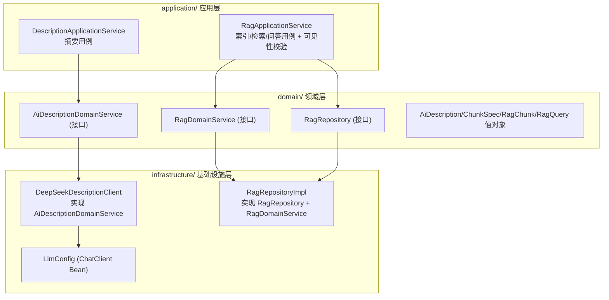
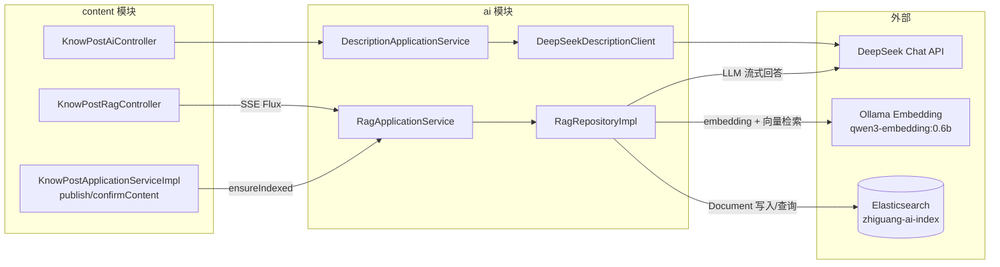

## 1. 模块是什么

AI 模块是知识分享社区的**人工智能能力层**，提供两大能力：

1. **AI 摘要生成** — 基于知文正文，用 DeepSeek Chat 生成不超过 50 字的中文描述
2. **RAG 问答** — 将知文正文切块向量化存入 ES，用户提问时检索相关内容块，交给 LLM 流式作答（SSE）

**重要特征**: AI 模块**没有自己的 Controller**——它的能力通过 content 模块的 `KnowPostAiController`（摘要建议）和 `KnowPostRagController`（RAG 问答/重索引）对外暴露。

## 2. 两大子系统

| 子系统   | 入口服务                        | LLM                              | 输出                    | 使用方                              |
| -------- | ------------------------------- | -------------------------------- | ----------------------- | ----------------------------------- |
| 摘要生成 | `DescriptionApplicationService` | DeepSeek Chat (`deepseek-chat`)  | 同步单次结果            | content 的 description/suggest 接口 |
| RAG 问答 | `RagApplicationService`         | DeepSeek Chat + Ollama Embedding | SSE 流 (`Flux<String>`) | content 的 qa/stream、rag/reindex   |

## 3. 分层架构

**⚠️ 架构特征**: 与 user/social/content 不同，本模块的**领域服务是接口**，由基础设施类实现：

- `AiDescriptionDomainService` 接口 ← `DeepSeekDescriptionClient`（infra）
- `RagDomainService` + `RagRepository` 两个接口 ← **同一个** `RagRepositoryImpl`（infra）

即"领域服务"实际是基础设施对 AI 客户端的薄封装，DDD 纯度较低（务实取向）。

## 4. 文件清单与职责（14 个文件）

### application/ 应用层 (2 个)

| 文件                                         | 职责                                                                       |
| -------------------------------------------- | -------------------------------------------------------------------------- |
| `service/DescriptionApplicationService.java` | 摘要用例（薄封装）                                                         |
| `service/RagApplicationService.java`         | RAG 用例：reindex/ensureIndexed/query + **可见性校验**（published+public） |

### domain/ 领域层 (8 个)

| 文件                                      | 职责                                                                       |
| ----------------------------------------- | -------------------------------------------------------------------------- |
| `service/AiDescriptionDomainService.java` | 摘要领域服务接口                                                           |
| `service/RagDomainService.java`           | RAG 领域服务接口（indexPost/query）                                        |
| `repository/RagRepository.java`           | 向量仓储接口（indexChunks/searchSimilar/deleteByPostId/fingerprintExists） |
| `model/valueobject/AiDescription.java`    | AI 描述值对象（归一化 + 50 字截断）                                        |
| `model/valueobject/ChunkSpec.java`        | 切块规格（800 字/100 字重叠）                                              |
| `model/valueobject/RagChunk.java`         | RAG 文本块                                                                 |
| `model/valueobject/RagQuery.java`         | RAG 查询（postId/question/topK 校验）                                      |

### infrastructure/ 基础设施层 (4 个)

| 文件                                 | 职责                                                              |
| ------------------------------------ | ----------------------------------------------------------------- |
| `llm/LlmConfig.java`                 | `ChatClient` Bean（基于 deepSeekChatModel）                       |
| `llm/DeepSeekDescriptionClient.java` | DeepSeek 摘要调用（ChatClient + DeepSeekChatOptions）             |
| `vectorstore/RagRepositoryImpl.java` | RAG 实现：切块/向量索引/检索/LLM 流式问答（同时实现两个领域接口） |

## 5. 被调用入口

AI 模块无 REST 接口，由 content 模块暴露：

| HTTP 接口                                    | Controller (content)    | ai 服务                                             |
| -------------------------------------------- | ----------------------- | --------------------------------------------------- |
| `POST /api/v1/knowposts/description/suggest` | `KnowPostAiController`  | `DescriptionApplicationService.generateDescription` |
| `GET /api/v1/knowposts/{id}/qa/stream` (SSE) | `KnowPostRagController` | `RagApplicationService.query`                       |
| `POST /api/v1/knowposts/{id}/rag/reindex`    | `KnowPostRagController` | `RagApplicationService.reindex`                     |
| 发布/内容确认自动触发                        | content 业务层          | `RagApplicationService.ensureIndexed`               |

## 6. 架构图

## 7. 外部依赖

| 依赖                                  | 用途                  | 配置                                                                             |
| ------------------------------------- | --------------------- | -------------------------------------------------------------------------------- |
| DeepSeek Chat                         | 摘要生成 + RAG 问答   | `spring.ai.deepseek.api-key`（.env 注入）                                        |
| Ollama Embedding                      | 文本向量化            | `spring.ai.ollama.base-url: http://localhost:11434`，模型 `qwen3-embedding:0.6b` |
| Elasticsearch (Spring AI VectorStore) | 向量存储/余弦检索     | `spring.ai.vectorstore.elasticsearch.index-name: zhiguang-ai-index`              |
| ES Java Client (shared)               | 精确查询（指纹/删除） | `spring.elasticsearch.uris`                                                      |
| content 模块                          | 正文读取              | `KnowPostMapper.findDetailById`                                                  |

---

> 下一篇: [01-接口层与请求详解](01-接口层与请求详解.md)
