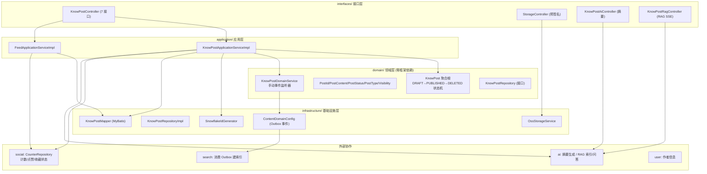
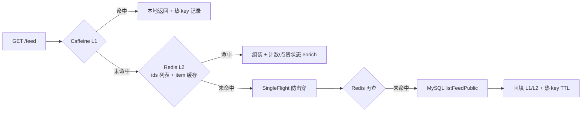

## 1. 模块是什么

Content 模块是知识分享社区的**内容生产与分发子系统**，管理"知文 (KnowPost)"的完整生命周期：创建草稿 → 上传正文至 OSS → 确认内容 → 更新元数据 → 发布 → 软删除，以及面向用户的 **Feed 信息流**（公共广场 / 我的发布）与 **知文详情**。

它是平台**体量最大**的模块（约 50 个文件），也是与 social（计数/关注）、ai（摘要/RAG）、search（索引）、user（作者信息）交互最密集的模块。

## 2. 核心职责

| 子系统       | 职责                                                | 核心类                                               |
| ------------ | --------------------------------------------------- | ---------------------------------------------------- |
| 知文生命周期 | 草稿/内容确认/元数据/发布/置顶/可见性/删除          | `KnowPostApplicationServiceImpl` + `KnowPost` 聚合根 |
| Feed 流      | 公共广场分页、我的发布分页（多级缓存）              | `FeedApplicationServiceImpl`                         |
| 对象存储     | OSS 预签名直传 URL、头像上传、公开 URL 拼接         | `OssStorageService`                                  |
| 缓存基础设施 | Caffeine L1 + Redis L2 + 热 key 检测 + SingleFlight | `CacheConfig` + `HotKeyDetector`                     |
| 事件/索引    | Outbox 事件（供 search 索引）、RAG 预索引           | `ContentDomainConfig` + `RagApplicationService`      |

## 3. DDD 四层架构

**依赖方向**: interfaces → application → domain ← infrastructure。领域层通过 `Consumer<T>` 手动监听器保持零 Spring 依赖，由 `ContentDomainConfig` 装配。

## 4. 文件清单与职责

### interfaces/ 接口层 (16 个文件)

| 文件                              | 职责                         |
| --------------------------------- | ---------------------------- |
| `rest/KnowPostController.java`    | 知文 CRUD + Feed/详情 7 接口 |
| `rest/StorageController.java`     | OSS 预签名直传 URL           |
| `rest/KnowPostAiController.java`  | AI 摘要建议 (委托 ai 模块)   |
| `rest/KnowPostRagController.java` | RAG 问答 SSE 流 + 重索引     |
| `dto/` (12 个)                    | 请求/响应对象                |

### application/ 应用层 (4 个文件)

| 文件                                               | 职责                           |
| -------------------------------------------------- | ------------------------------ |
| `service/KnowPostApplicationService.java`          | 知文用例接口                   |
| `service/impl/KnowPostApplicationServiceImpl.java` | 知文用例实现（含详情多级缓存） |
| `service/FeedApplicationService.java`              | Feed 用例接口                  |
| `service/impl/FeedApplicationServiceImpl.java`     | Feed 用例实现（三级缓存）      |

### domain/ 领域层 (8 个文件)

| 文件                                 | 职责                                              |
| ------------------------------------ | ------------------------------------------------- |
| `model/aggregate/KnowPost.java`      | 知文聚合根（状态机 + 领域行为）                   |
| `model/valueobject/` (5 个)          | PostId/PostContent/PostStatus/PostType/Visibility |
| `repository/KnowPostRepository.java` | 仓储接口                                          |
| `service/KnowPostDomainService.java` | 可见性校验/发布校验/事件监听器                    |
| `event/` (3 个)                      | Published/Deleted/ContentUpdated 事件             |

### infrastructure/ 基础设施层 (10 个文件)

| 文件                                                    | 职责                             |
| ------------------------------------------------------- | -------------------------------- |
| `id/SnowflakeIdGenerator.java`                          | 雪花 ID 生成                     |
| `config/ContentDomainConfig.java`                       | 领域服务装配 + Outbox 事件桥接   |
| `persistence/KnowPostRepositoryImpl.java`               | 仓储实现（领域↔PO 转换）         |
| `persistence/mapper/KnowPostMapper.java`                | MyBatis Mapper                   |
| `persistence/model/` (3 个)                             | KnowPostPO/FeedRowPO/DetailRowPO |
| `storage/OssProperties.java` / `OssStorageService.java` | OSS 配置与上传/预签名            |

## 5. 请求路由总表

所有接口前缀 `/api/v1`，认证通过 Sa-Token（`StpUtil.getLoginIdAsLong()`）。

### KnowPostController — 知文 (10 个, 前缀 `/api/v1/knowposts`)

| #   | 方法   | 路径                    | 需登录        | 说明                |
| --- | ------ | ----------------------- | ------------- | ------------------- |
| 1   | POST   | `/drafts`               | ✅            | 创建草稿            |
| 2   | POST   | `/{id}/content/confirm` | ✅            | 确认 OSS 内容元数据 |
| 3   | PATCH  | `/{id}`                 | ✅            | 更新元数据          |
| 4   | POST   | `/{id}/publish`         | ✅            | 发布                |
| 5   | PATCH  | `/{id}/top`             | ✅            | 置顶切换            |
| 6   | PATCH  | `/{id}/visibility`      | ✅            | 修改可见性          |
| 7   | DELETE | `/{id}`                 | ✅            | 软删除              |
| 8   | GET    | `/feed`                 | ❌ (可选登录) | 公共广场            |
| 9   | GET    | `/mine`                 | ✅            | 我的发布            |
| 10  | GET    | `/detail/{id}`          | ❌ (可选登录) | 知文详情            |

### StorageController — 存储 (1 个)

| #   | 方法 | 路径                      | 需登录 | 说明                    |
| --- | ---- | ------------------------- | ------ | ----------------------- |
| 11  | POST | `/api/v1/storage/presign` | ✅     | 获取 OSS 预签名 PUT URL |

### AI 相关 (2 个, 前缀 `/api/v1/knowposts`)

| #   | 方法 | 路径                   | 需登录    | 说明            |
| --- | ---- | ---------------------- | --------- | --------------- |
| 12  | POST | `/description/suggest` | ✅        | AI 摘要建议     |
| 13  | GET  | `/{id}/qa/stream`      | ❌ (放行) | RAG 问答 SSE 流 |
| 14  | POST | `/{id}/rag/reindex`    | ✅        | RAG 重索引      |

## 6. 核心架构图

### 6.1 知文发布链路

### 6.2 Feed 读链路（三级缓存）

## 7. 存储全景

### MySQL (1 张主表)

| 表           | 用途                               | 关键索引                                                                                               |
| ------------ | ---------------------------------- | ------------------------------------------------------------------------------------------------------ |
| `know_posts` | 知文主表（正文元数据，正文在 OSS） | `(creator_id, create_time)`, `(status, create_time)`, `(tag_id, create_time)`, `(is_top, create_time)` |

### Redis 结构 (6 类)

| Key 模式                                   | 类型   | 用途                        | TTL                  |
| ------------------------------------------ | ------ | --------------------------- | -------------------- |
| `feed:public:{size}:{page}:v{ver}`         | String | 公共 Feed 页 JSON           | 60-90s + 热 key 扩展 |
| `feed:public:ids:{size}:{hourSlot}:{page}` | List   | 页内 ID 列表                | 60-90s               |
| `feed:item:{id}`                           | String | Feed 单项缓存               | 60-90s + 热 key 扩展 |
| `feed:public:index:{id}:{hourSlot}`        | Set    | 单项→所在页索引（失效用）   | 60-90s               |
| `knowpost:detail:{id}:v{ver}`              | String | 详情页缓存（"NULL" 负缓存） | 60-90s               |
| `feed:mine:{userId}:{size}:{page}`         | String | 我的发布页缓存              | 30-50s               |

### 内存 (Caffeine, 3 个 Cache)

| Bean                  | 用途            | 默认配置              |
| --------------------- | --------------- | --------------------- |
| `feedPublicCache`     | 公共 Feed 页 L1 | maxSize 1000, TTL 15s |
| `feedMineCache`       | 我的发布 L1     | maxSize 1000, TTL 10s |
| `knowPostDetailCache` | 详情 L1         | maxSize 5000, TTL 30s |

### 对象存储 (OSS)

| 用途     | Key 模式                                   | 上传方式     |
| -------- | ------------------------------------------ | ------------ |
| 知文正文 | `posts/{postId}/content{ext}`              | 预签名直传   |
| 知文图片 | `posts/{postId}/images/{date}/{rand}{ext}` | 预签名直传   |
| 用户头像 | `avatars/{userId}-{ts}{ext}`               | 后端转发上传 |

## 8. 关键设计思想

1. **正文与元数据分离**: 正文存 OSS（URL+ETag+SHA256 校验），MySQL 只存元数据，DB 体量小、读快
2. **客户端直传 OSS**: 预签名 URL 让客户端直接上传，后端零流量转发（头像除外）
3. **三级缓存 + 防击穿**: Caffeine L1 → Redis L2（页 ID 列表 + 单项缓存）→ MySQL；SingleFlight 防止缓存击穿
4. **热 key 动态 TTL**: `HotKeyDetector` 滑动窗口统计热度，热度越高 TTL 越长（最高 +120s），热门内容驻留更久
5. **负缓存**: 详情不存在时缓存 `"NULL"` 30-60s，防止不存在内容的反复 DB 查询
6. **雪花 ID 全局唯一**: 知文 ID 由雪花算法生成（非自增），跨库可迁移、无需依赖自增序列
7. **Outbox 事件驱动索引**: 发布/删除写 outbox，search 模块消费建立 ES 索引，解耦内容与搜索
8. **热度感知失效**: `feed:public:index:{id}:{hour}` 记录"单项出现在哪些页"，点赞/收藏变化时原地更新受影响页（`FeedCacheInvalidationListener`）

---

> 下一篇: [01-接口层与请求详解](01-接口层与请求详解.md) — 14 个接口逐一拆解
