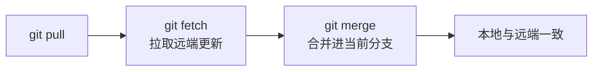
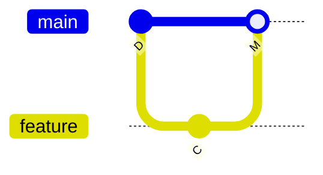
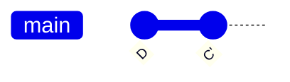
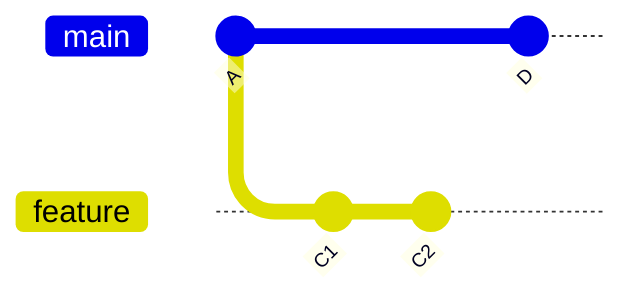
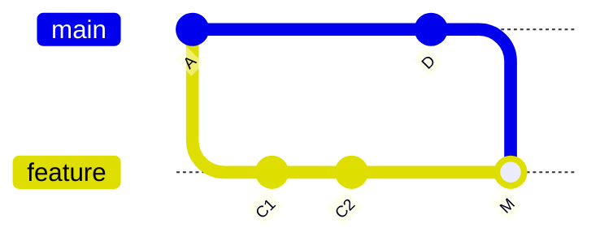
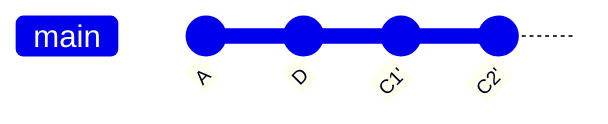
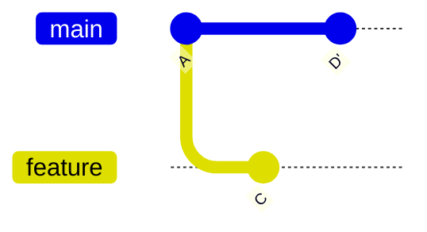
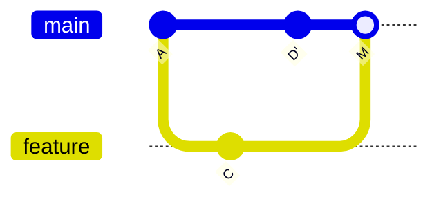
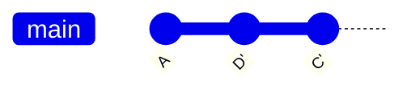
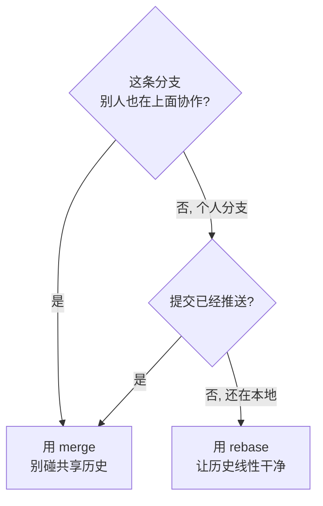

# git pull 到底用 merge 还是 rebase？

---

刚开始跟别人协作时，我 `git pull` 一遇到"本地改了、远端也改了"就头皮发麻——要么弹出一堆合并记录，要么历史里多出几个乱七八糟的 merge commit，时间线像被狗啃过。后来把 merge 和 rebase 的区别捋清楚，才知道这俩不是哪个更好的问题，而是**什么时候用哪个**的问题。

## 先搞清楚 `git pull` 到底做了什么

`git pull` 其实是两步的合体：`git fetch`（把远端更新拉下来）+ `git merge`（把远端更新合进当前分支）。

也就是说，你什么都不写地 `git pull`，走的就是 **merge**。

如果想走 **rebase**，要显式加参数：

```bash
git pull --rebase
```

整个流程可以看成：



## merge 和 rebase 的本质区别

假设远端在你本地提交之后多了一个 commit `D`，你本地有一个还没推送的 commit `C`：

- **merge**：把 `C` 和 `D` 合并，产生一个新的 merge commit，两条线并进。历史是"真实"的，但会多出一个合并点。
- **rebase**：把你的 `C` 从原来的位置"摘下来"，重放到 `D` 之后，变成 `C'`。历史变成一条直线，但 `C` 的 commit hash 变了（等于"改写"了本地提交）。

可以理解成：**merge 保留历史原貌，rebase 整理历史**。

两种方式的效果，用提交图看更直观。这是 **merge**（产生一个合并提交 `M`）：



这是 **rebase** 之后（你的 `C` 被重放成 `C'`，历史变成一条直线）：



## 什么时候用 merge

- **公共分支**（如 `main`、`develop`）：大家都要在这上面协作，历史是共享的。merge 不重写任何已存在的提交，最安全。
- **需要完整真实的开发记录**：比如要看清"这行代码是哪次合并带进来的"，merge commit 能保留脉络。
- **团队约定就是合并**：跟同事说好用 merge 就统一 merge，别一半人 merge 一半人 rebase，历史会乱套。

## 什么时候用 rebase

- **个人 feature 分支**：你一个人干活，把主分支的最新代码拉进来，用 `--rebase` 能让你的提交干干净净排在最新之上，PR 评审时历史一目了然。
- **推送之前**：提交 PR 前 `git pull --rebase origin main`，确保你的分支是主分支最新 + 你的提交，没有多余的 merge commit。
- **想让提交历史保持线性**：自己维护的小仓库、或者喜欢整洁时间线的场景。

我自己的习惯：**主分支用 merge（别去动共享历史），自己的分支用 rebase（整理好自己的提交）**。

## 冲突怎么处理

### `git pull`（merge）冲突

```text
CONFLICT (content): Merge conflict in xxx.md
```

解决冲突、`git add` 后，**直接 `git commit`** 完成合并（Git 会生成 merge commit）：

```bash
git add xxx.md
git commit
```

### `git pull --rebase` 冲突

冲突后你正处于 rebase 中间，解决完要告诉 rebase"继续"：

```bash
# 1. 手动解决冲突，然后暂存
git add xxx.md

# 2. 继续 rebase
git rebase --continue
```

如果发现自己改岔了、不想继续，随时可以**整个放弃**：

```bash
git rebase --abort
```

## 方向：永远在当前分支上吸收目标分支

很多刚接触的人会搞混该在哪个分支上敲命令，这里单独拎出来说清楚。

**merge / rebase 的方向永远是：当前所在分支 ← 吸收目标分支。**

比如你从 `main` 迁出 `feature`，在 `feature` 上提交了 `C1 C2`，期间 `main` 被别人推了新提交 `D`。你要让 feature 跟上 main，就把操作放在 **feature 分支**上执行：

```bash
git checkout feature        # 当前分支 = 吸收方
git merge origin/main       # 或 git rebase origin/main
```

- `git merge main` 的意思是"把 `main` 的提交合进**当前分支**"，所以 `D` 进到 feature，**main 本身不动**。
- `git rebase main` 同理：把 feature 的提交重放到 `main` 的最新提交之后。

示意图：



在 feature 上 `git merge main`，得到：



在 feature 上 `git rebase main`，得到（线性）：



两个容易混的点：

1. **这一步不会让 main 拥有 feature 的代码。** 要把 feature 合回主干是另一回事：切到 `main` 上 `git merge feature`，或者走 PR。日常节奏是分开的——
   - 同步 main 最新到 feature → **在 feature 上** `merge/rebase main`
   - 收尾合入主干 → **在 main 上** `merge feature`（或 PR）
2. **rebase 会改写 feature 的提交 hash。** feature 还没推送时随便 rebase；一旦 push 出去被共享，就改用 merge。

## 实操示例：同一个场景，两种做法

场景是这样的：你在本地 `main` 上提交了一个 `C`（还没推送），同事往远端 `main` 推了一个 `D'`。现在的图景是分叉的：



> 说明：`feature` 那条线就是你的本地工作（`A → C`），`main` 上多了同事的 `D'`。下面 `git pull` 时分别走 merge 和 rebase。

### 做法一：merge

```bash
# 1. 先看清楚远端和本地差在哪
git fetch
git log --oneline --graph --all

# 2. 直接 pull（默认就是 merge）
git pull

# 3. 如果有冲突：
git status              # 看到 CONFLICT 标记和冲突文件
git add <冲突的文件>      # 手动解决后暂存
git commit              # 完成 merge，Git 生成合并提交 M
```

合并之后，`C` 和 `D'` 汇成一条线，多出一个合并提交 `M`：



### 做法二：rebase

```bash
# 1. 拉取并把你的 C 重放到 D' 之后
git pull --rebase

# 2. 如果有冲突：
git status              # 提示你正处于 rebasing 状态
git add <冲突的文件>
git rebase --continue   # 解决完继续

# 3. 发现搞乱了？一键放弃，回到 pull 之前的状态
git rebase --abort

# 4. 收尾看一眼历史
git log --oneline --graph
```

rebase 之后，你的 `C` 被重写成 `C'` 排到 `D'` 后面，历史是一条直线：



### 命令对照速查

| 环节       | merge                                  | rebase                  |
| ---------- | -------------------------------------- | ----------------------- |
| 拉取       | `git pull`                             | `git pull --rebase`     |
| 冲突后暂存 | `git add`                              | `git add`               |
| 冲突后继续 | `git commit`（生成合并提交）           | `git rebase --continue` |
| 想放弃     | 解决一半也可以直接 `git merge --abort` | `git rebase --abort`    |
| 结果       | 多一个 merge commit                    | 提交被重写，历史线性    |

> 两种做法里 `git add` 都一样，区别只在"继续"这一步：merge 用 `git commit` 收尾，rebase 用 `git rebase --continue` 收尾。

## 最大的坑：rebase 会改写历史

记住这条铁律：**已经被推送到公共分支的提交，绝不要 rebase**。

因为 rebase 会重新生成 commit hash，你一旦 rebase 了一个已经推上去的提交，本地和远端的历史就对不上了，别人 `pull` 会拉出两条线甚至冲突，最后只能靠 `git push --force` 硬覆盖——这在协作仓库里等于给队友挖坑。

所以：**只对"还没推送出去"的本地提交做 rebase**，推送出去的用 merge。

## 顺手配置默认行为

如果你已经想清楚自己更常用哪种，可以直接把默认行为改掉，以后 `git pull` 就走对应方式：

```bash
# 默认 merge（Git 原始行为）
git config --global pull.rebase false

# 默认 rebase
git config --global pull.rebase true
```

也可以用 `git pull --rebase=false` / `--rebase=true` 单次覆盖。

## 小结

- 共享/公共分支 → **merge**，别动历史。
- 个人分支、提交 PR 前 → **rebase**，让历史干净线性。
- 冲突不可怕：merge 冲突 `add` 后 `commit`，rebase 冲突 `add` 后 `rebase --continue`。
- rebase 会改写 hash，**只重写自己的、没推送的提交**。

拿不准的时候，照着下面这条线走就行：


