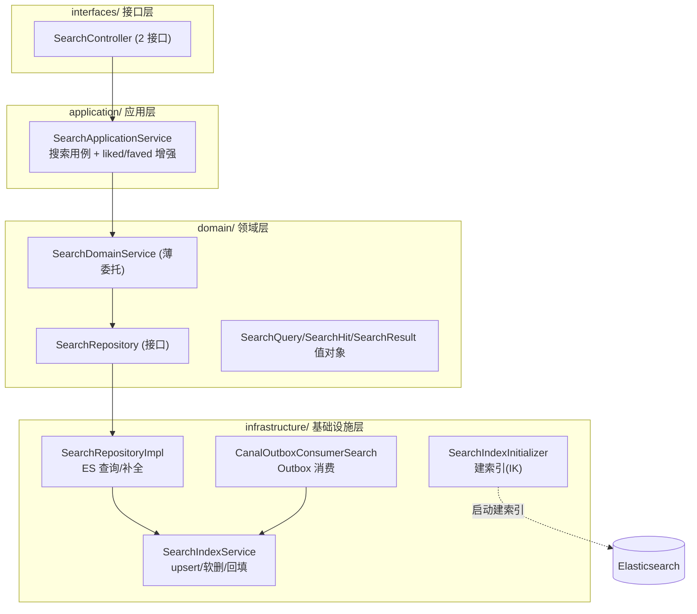
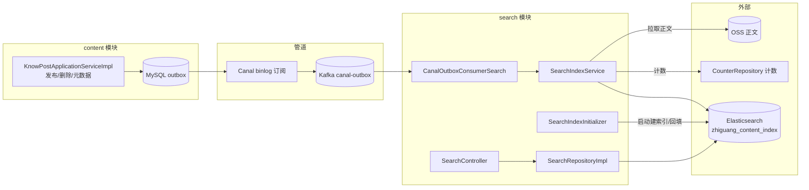

## 1. 模块是什么

Search 模块是知识分享社区的**全文搜索与标题补全**子系统，基于 **Elasticsearch 9.2.1** 提供两大能力：

1. **全文搜索** — 对知文标题/正文（IK 中文分词）检索，支持标签过滤、热度加权、高亮摘要、search_after 游标分页
2. **标题补全 (suggest)** — 基于 completion suggester 的输入框联想

**索引来源**: content 模块写 outbox 事件 → Canal 订阅 binlog → Kafka → `CanalOutboxConsumerSearch` 消费 → ES 索引 upsert/软删。首次启动且索引为空时自动回填。

## 2. 核心职责

| 子系统   | 职责                                     | 核心类                                          |
| -------- | ---------------------------------------- | ----------------------------------------------- |
| 全文搜索 | 关键词/标签检索 + 排序 + 高亮 + 游标分页 | `SearchRepositoryImpl.search`                   |
| 标题补全 | completion 前缀建议                      | `SearchRepositoryImpl.suggest`                  |
| 索引维护 | 建索引(IK 映射)/回填/upsert/软删         | `SearchIndexInitializer` + `SearchIndexService` |
| 事件消费 | Outbox → 索引联动                        | `CanalOutboxConsumerSearch`                     |

## 3. 分层架构



**特点**: 标准 DDD 四层，`SearchDomainService` 是纯委托（无业务逻辑）；`SearchRepositoryImpl` 直接注入 `SearchIndexService`（infra 内协作）。

## 4. 文件清单与职责（14 个文件）

### interfaces/ 接口层 (4 个)

| 文件                         | 职责                                           |
| ---------------------------- | ---------------------------------------------- |
| `rest/SearchController.java` | 搜索 + 补全 2 个接口                           |
| `dto/SearchResponse.java`    | 搜索响应（复用 content 的 `FeedItemResponse`） |
| `dto/SuggestResponse.java`   | 补全响应                                       |

### application/ 应用层 (1 个)

| 文件                                    | 职责                                                  |
| --------------------------------------- | ----------------------------------------------------- |
| `service/SearchApplicationService.java` | SearchHit → FeedItemResponse 映射 + 点赞/收藏状态增强 |

### domain/ 领域层 (5 个)

| 文件                                  | 职责                                   |
| ------------------------------------- | -------------------------------------- |
| `service/SearchDomainService.java`    | 薄委托（search/suggest/index/deindex） |
| `repository/SearchRepository.java`    | 仓储接口                               |
| `model/valueobject/SearchQuery.java`  | 查询入参（keyword/size/tags/after）    |
| `model/valueobject/SearchHit.java`    | 命中文档 + fromSource 转换             |
| `model/valueobject/SearchResult.java` | 结果集 + 游标                          |

### infrastructure/ 基础设施层 (4 个)

| 文件                                | 职责                                                       |
| ----------------------------------- | ---------------------------------------------------------- |
| `es/SearchRepositoryImpl.java`      | ES 查询 DSL（function_score/高亮/search_after/completion） |
| `es/SearchIndexService.java`        | 索引 upsert/软删/启动回填 + 正文拉取与字符集探测           |
| `es/SearchIndexInitializer.java`    | 启动时创建索引（IK 分析器映射）                            |
| `es/CanalOutboxConsumerSearch.java` | 消费 outbox 事件 → 索引联动                                |
| `config/SearchDomainConfig.java`    | Bean 装配                                                  |

## 5. 请求路由总表

| #   | 方法 | 路径                                   | 需登录 | 说明                                |
| --- | ---- | -------------------------------------- | ------ | ----------------------------------- |
| 1   | GET  | `/api/v1/search?q=&size=&tags=&after=` | 可选   | 全文搜索（登录时返回点赞/收藏状态） |
| 2   | GET  | `/api/v1/search/suggest?prefix=&size=` | ❌     | 标题补全                            |

（`/api/v1/search/suggest` 在 Sa-Token 放行名单中；`/api/v1/search` 未放行——但 controller 用 `StpUtil.isLogin()` 可选登录，实际未登录也会被拦截？需确认放行配置。见 [01 文档](01-接口层与请求详解.md)。）

## 6. 架构图



## 7. 数据流全景

```
索引写入: content 发布/删除 → outbox → Canal → Kafka → CanalOutboxConsumerSearch → SearchIndexService.upsert/softDelete → ES
启动回填: 索引为空 → @PostConstruct 全量回填 (listFeedPublic 分批 500)
搜索读取: GET /search → SearchApplicationService → SearchRepositoryImpl(ES) → 映射 FeedItemResponse + liked/faved → 响应
```

---

> 下一篇: [01-接口层与请求详解](01-接口层与请求详解.md)
