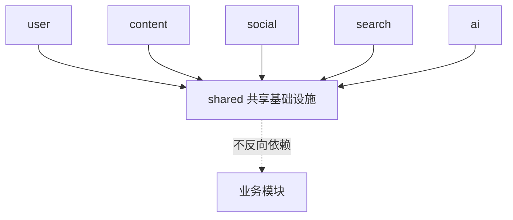
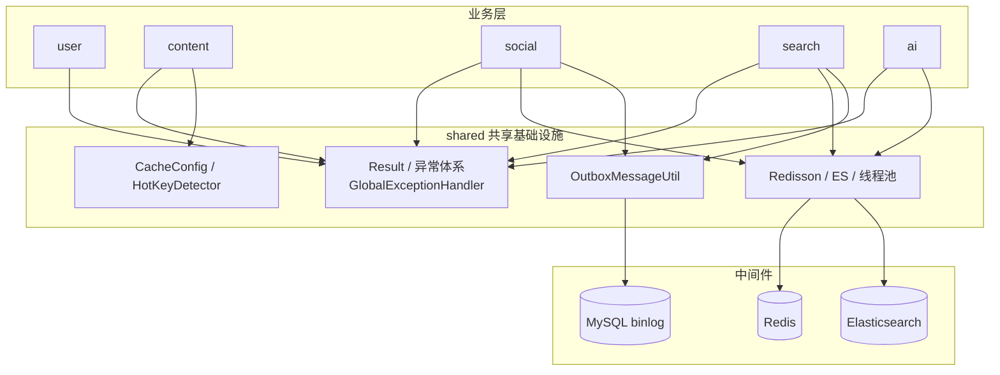

## 1. 模块是什么

Shared 模块是知识分享社区的**共享基础设施层**，不包含任何业务逻辑，为 ai/content/search/social/user 五个业务模块提供通用能力：

| 能力域         | 提供什么                                                                                                  |
| -------------- | --------------------------------------------------------------------------------------------------------- |
| 通用响应与异常 | `Result<T>` 统一响应、`BusinessException` + `ErrorCode` 错误码体系、`GlobalExceptionHandler` 全局异常处理 |
| 缓存基础设施   | Caffeine Cache Bean 定义、缓存配置属性、`HotKeyDetector` 热 key 检测                                      |
| 中间件客户端   | Redisson 客户端、Elasticsearch 客户端、线程池 `taskExecutor`                                              |
| 工具类         | `OutboxMessageUtil` Canal 消息解析                                                                        |

**关键特征**: 只有 `infrastructure` 一层（无 interfaces/application/domain），全部业务模块都依赖它，但它**不依赖任何业务模块**（依赖方向单向）。

## 2. 核心职责

| 组件                                   | 职责                             | 被谁使用                       |
| -------------------------------------- | -------------------------------- | ------------------------------ |
| `Result`                               | 统一 API 响应包装                | 所有 Controller                |
| `BusinessException` / `ErrorCode`      | 业务错误码体系                   | 所有业务层                     |
| `GlobalExceptionHandler`               | 全局异常 → 统一错误响应          | Spring MVC 自动生效            |
| `CacheConfig` / `CacheProperties`      | 三个 Caffeine Cache Bean + 配置  | content (Feed/详情)            |
| `HotKeyDetector`                       | 滑动窗口热 key 检测 + 动态 TTL   | content (Feed/详情)            |
| `RedissonConfig`                       | Redisson 客户端（分布式锁/限流） | social (CounterRepositoryImpl) |
| `ElasticsearchConfig` / `EsProperties` | ES 客户端                        | search、ai (RAG 向量库)        |
| `ThreadPoolConfig`                     | `taskExecutor` 线程池            | social (CanalKafkaBridge)      |
| `OutboxMessageUtil`                    | Canal binlog 消息解析            | social、search (Outbox 消费)   |

## 3. 与业务模块的关系

**依赖铁律**: 业务模块可以依赖 shared，shared **绝不能** import 任何业务模块（`com.buct.user/content/social/search/ai`）—— 违反即视为架构错误。

## 4. 文件清单与职责（12 个文件）

### exception/ 异常体系 (3 个)

| 文件                          | 职责                                           |
| ----------------------------- | ---------------------------------------------- |
| `BusinessException.java`      | 业务异常（携带 ErrorCode + 消息）              |
| `ErrorCode.java`              | 错误码枚举（14 个：标识/验证码/凭证/权限等）   |
| `GlobalExceptionHandler.java` | `@RestControllerAdvice` 全局异常 → 400/401/500 |

### web/ 统一响应 (1 个)

| 文件          | 职责                                                    |
| ------------- | ------------------------------------------------------- |
| `Result.java` | 泛型响应包装 `{code, message, data}`，null 字段不序列化 |

### cache/ 缓存基础设施 (3 个)

| 文件                          | 职责                                                                            |
| ----------------------------- | ------------------------------------------------------------------------------- |
| `config/CacheConfig.java`     | 三个 Caffeine Bean：`feedPublicCache` / `feedMineCache` / `knowPostDetailCache` |
| `config/CacheProperties.java` | 缓存配置属性（TTL/容量/热 key 阈值）                                            |
| `hotkey/HotKeyDetector.java`  | 滑动窗口热度统计 + 热度分级 + 动态 TTL 计算                                     |

### config/ 中间件配置 (4 个)

| 文件                       | 职责                                              |
| -------------------------- | ------------------------------------------------- |
| `RedissonConfig.java`      | Redisson 单机客户端（锁看门狗 30s）               |
| `ElasticsearchConfig.java` | ES Java Client 9.x（Rest5 transport）             |
| `EsProperties.java`        | ES 连接配置（uris/账号/索引名）                   |
| `ThreadPoolConfig.java`    | `taskExecutor` 线程池（10 核心/50 最大/200 队列） |

### util/ 工具 (1 个)

| 文件                     | 职责                                 |
| ------------------------ | ------------------------------------ |
| `OutboxMessageUtil.java` | 从 Canal JSON 消息提取 outbox 行数据 |

## 5. 依赖矩阵

| 共享组件                        | 使用方                     | 用途                          |
| ------------------------------- | -------------------------- | ----------------------------- |
| `Result`                        | 全部 5 个模块的 Controller | 统一响应                      |
| `BusinessException`/`ErrorCode` | 全部业务层                 | 错误抛出                      |
| `GlobalExceptionHandler`        | 全局                       | 异常 → HTTP 400/401/500       |
| `CacheConfig` Bean              | content                    | Feed/详情 L1 缓存             |
| `HotKeyDetector`                | content                    | Feed/详情热 key TTL 延长      |
| `RedissonClient`                | social                     | SDS 重建分布式锁/限流         |
| `ElasticsearchClient`           | search、ai                 | 全文检索、RAG 向量库          |
| `taskExecutor`                  | social                     | CanalKafkaBridge 异步消费线程 |
| `OutboxMessageUtil`             | social、search             | Canal outbox 消息解析         |

**引用统计**（按文件数）：content 7 · user 5 · social 4 · ai 3 · search 2。

## 6. 架构图

## 7. 设计思想

1. **单一出口**: 所有 API 响应走 `Result<T>`，所有异常走 `GlobalExceptionHandler` —— 客户端契约统一，业务层无需关心 HTTP 细节
2. **错误码集中管理**: `ErrorCode` 枚举集中定义 14 个业务错误码，跨模块复用，避免各模块自造错误
3. **缓存能力下沉**: Feed/详情的 L1 缓存 Bean 与热 key 检测放在 shared，content 只注入使用 —— 未来其他模块需要缓存时直接复用
4. **中间件客户端统一创建**: Redis(Redisson)/ES/线程池统一在 shared 创建，各模块只管注入，避免重复配置
5. **热 key 检测自研**: 用固定分段滑动窗口（而非 Redis/其他框架）实现热度统计，本地无锁计数，开销极低
6. **零业务依赖**: shared 不 import 任何业务包，保证依赖方向单向、可独立测试

---

> 下一篇: [01-通用响应与异常处理](01-通用响应与异常处理.md)
