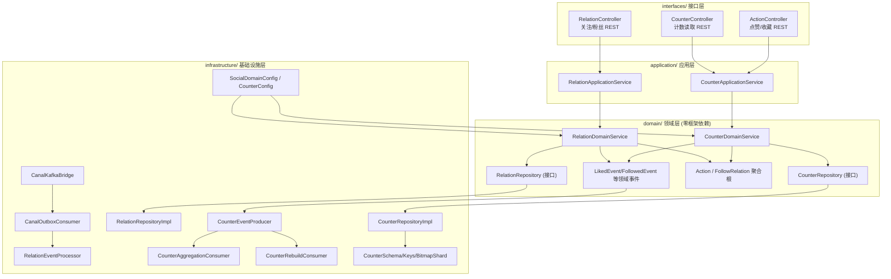
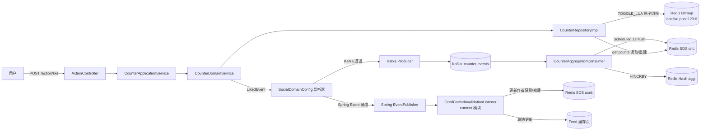
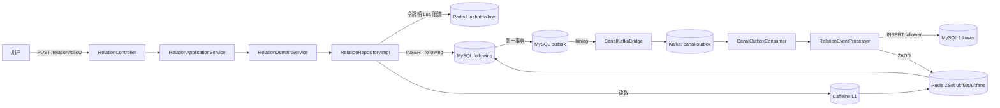

## 1. 模块是什么

Social 模块是知识分享平台的**社交互动子系统**，核心职责有两块：

1. **点赞 / 收藏计数** — 用户对知文 (KnowPost) 点赞、取消点赞、收藏、取消收藏，并对外提供实时计数读取
2. **关注 / 粉丝关系** — 用户关注他人、取关、查询关注/粉丝列表、查询关注状态

整个模块围绕"**高并发、高读取、强一致弱化**"的社交场景设计：写操作走 Redis + 异步消息，读操作走多级缓存，最终一致性由 Outbox 模式 + 定时校验兜底。

## 2. 两大子系统

| 子系统         | 领域服务                | 存储核心                                       | 数据一致性策略                              |
| -------------- | ----------------------- | ---------------------------------------------- | ------------------------------------------- |
| Counter 计数器 | `CounterDomainService`  | Redis Bitmap (状态) + Redis SDS (汇总)         | 写时双通道 (Kafka + Spring Event)，异步聚合 |
| Relation 关系  | `RelationDomainService` | MySQL (following/follower/outbox) + Redis ZSet | Outbox 模式 + Canal 订阅 binlog             |

两个子系统相互配合：关注/取关时，Relation 会通过 `CounterRepository` 同步更新用户的关注数/粉丝数 SDS。

## 3. DDD 四层架构

Social 模块严格遵循 **DDD (领域驱动设计) 四层架构**：

**依赖方向铁律**: interfaces → application → domain ← infrastructure。领域层不 import 任何 Spring 类（通过手动 `Consumer` 监听器 + 仓储接口实现解耦），这是本模块最核心的架构约束。

## 4. 文件清单与职责

### interfaces/ 接口层 (8 个文件)

| 文件                           | 职责                                        |
| ------------------------------ | ------------------------------------------- |
| `rest/ActionController.java`   | 点赞/收藏 4 个接口                          |
| `rest/CounterController.java`  | 计数读取 1 个接口                           |
| `rest/RelationController.java` | 关注/粉丝 6 个接口                          |
| `dto/ActionRequest.java`       | 点赞/收藏请求体 `{entityType, entityId}`    |
| `dto/CountsResponse.java`      | 计数响应体 `{entityType, entityId, counts}` |

### application/ 应用层 (2 个文件)

| 文件                                      | 职责                                                   |
| ----------------------------------------- | ------------------------------------------------------ |
| `service/CounterApplicationService.java`  | 计数器应用服务，构造 Action 聚合、编排领域服务与仓储   |
| `service/RelationApplicationService.java` | 关系应用服务，关注/取关/列表查询，组装 ProfileResponse |

### domain/ 领域层 (19 个文件)

| 目录                 | 文件                              | 职责                                                |
| -------------------- | --------------------------------- | --------------------------------------------------- |
| `service/`           | `CounterDomainService.java`       | 点赞/收藏领域逻辑 + 事件监听器注册                  |
| `service/`           | `RelationDomainService.java`      | 关注领域逻辑 + 事件监听器注册                       |
| `repository/`        | `CounterRepository.java`          | 计数器仓储接口 (15 个方法)                          |
| `repository/`        | `RelationRepository.java`         | 关系仓储接口 (12 个方法)                            |
| `model/aggregate/`   | `Action.java`                     | 点赞/收藏动作聚合根                                 |
| `model/aggregate/`   | `FollowRelation.java`             | 关注关系聚合根                                      |
| `model/valueobject/` | `ActionType.java`                 | 动作类型枚举 (LIKE/FAV)                             |
| `model/valueobject/` | `EntityType.java`                 | 实体类型枚举 (POST)                                 |
| `model/valueobject/` | `Counts.java` / `CountValue.java` | 计数值对象                                          |
| `model/valueobject/` | `RelationDirection.java`          | 关系方向枚举                                        |
| `model/valueobject/` | `RelationStatus.java`             | 关系状态枚举 (ACTIVE/CANCELED)                      |
| `event/`             | 6 个事件 record                   | Liked/Unliked/Favored/Unfavored/Followed/Unfollowed |

### infrastructure/ 基础设施层 (22 个文件)

| 目录                  | 文件                                        | 职责                               |
| --------------------- | ------------------------------------------- | ---------------------------------- |
| `config/`             | `SocialDomainConfig.java`                   | 注册领域服务 Bean + 事件监听器桥接 |
| `config/`             | `CounterConfig.java`                        | Kafka Producer Bean (条件启用)     |
| `messaging/`          | `CounterEventProducer.java`                 | 计数事件 → Kafka                   |
| `messaging/`          | `CounterAggregationConsumer.java`           | Kafka/Spring 事件聚合 + 定时 Flush |
| `messaging/`          | `CounterRebuildConsumer.java`               | 灾备全量重建消费者                 |
| `messaging/`          | `CanalKafkaBridge.java`                     | Canal binlog → Kafka               |
| `messaging/`          | `CanalOutboxConsumer.java`                  | Kafka canal-outbox → 事件处理      |
| `messaging/`          | `CounterEvent.java` / `RelationEvent.java`  | 消息体 record                      |
| `messaging/`          | `CounterTopics.java` / `OutboxTopics.java`  | topic 常量                         |
| `persistence/`        | `CounterRepositoryImpl.java`                | 位图/SDS/Lua/重建实现              |
| `persistence/`        | `RelationRepositoryImpl.java`               | 令牌桶/缓存/ZSet 实现              |
| `persistence/`        | `RelationEventProcessor.java`               | Outbox 事件消费处理                |
| `persistence/mapper/` | `RelationMapper.java` / `OutboxMapper.java` | MyBatis Mapper                     |
| `schema/`             | `CounterSchema.java`                        | SDS 结构定义                       |
| `schema/`             | `CounterKeys.java` / `UserCounterKeys.java` | Redis Key 生成                     |
| `schema/`             | `BitmapShard.java`                          | 位图分片算法                       |

## 5. 请求路由总表

所有接口前缀为 `/api/v1`，认证通过 **Sa-Token** (`StpUtil.getLoginIdAsLong()`) 从 JWT 中取用户 ID。

### ActionController — 点赞/收藏 (4 个)

| 方法 | 路径                    | 说明     |
| ---- | ----------------------- | -------- |
| POST | `/api/v1/action/like`   | 点赞     |
| POST | `/api/v1/action/unlike` | 取消点赞 |
| POST | `/api/v1/action/fav`    | 收藏     |
| POST | `/api/v1/action/unfav`  | 取消收藏 |

### CounterController — 计数读取 (1 个)

| 方法 | 路径                            | 说明                              |
| ---- | ------------------------------- | --------------------------------- |
| GET  | `/api/v1/counter/{etype}/{eid}` | 查询实体计数，可带 `metrics` 参数 |

### RelationController — 关注/粉丝 (6 个)

| 方法 | 路径                         | 说明                             |
| ---- | ---------------------------- | -------------------------------- |
| POST | `/api/v1/relation/follow`    | 关注 `?toUserId=X`               |
| POST | `/api/v1/relation/unfollow`  | 取关 `?toUserId=X`               |
| GET  | `/api/v1/relation/status`    | 关注状态 `?toUserId=X`           |
| GET  | `/api/v1/relation/following` | 关注列表 (offset 或 cursor 分页) |
| GET  | `/api/v1/relation/followers` | 粉丝列表                         |
| GET  | `/api/v1/relation/counter`   | 用户计数器 `?userId=X`           |

## 6. 核心架构图

### 6.1 计数器子系统

> 说明: Kafka 通道 → `CounterAggregationConsumer` 聚合实体 SDS；Spring Event 通道 → content 模块 `FeedCacheInvalidationListener` 更新用户获赞/被藏计数 + Feed 缓存。两者不是"冗余兜底"，而是**职责不同的两个消费者**。

### 6.2 关系子系统

## 7. 存储全景

### MySQL 表 (3 张)

| 表          | 用途                            | 关键索引                                                         |
| ----------- | ------------------------------- | ---------------------------------------------------------------- |
| `following` | 关注关系 (from→to)              | `UNIQUE(from_user_id, to_user_id)`, `(from_user_id, created_at)` |
| `follower`  | 粉丝关系 (to→from) 读写分离副本 | `UNIQUE(to_user_id, from_user_id)`, `(to_user_id, created_at)`   |
| `outbox`    | 事件发件箱                      | `(aggregate_type, aggregate_id)`, `(created_at)`                 |

### Redis 结构 (6 类)

| Key 模式                                | 类型             | 用途                                | 示例                 |
| --------------------------------------- | ---------------- | ----------------------------------- | -------------------- |
| `bm:{metric}:{etype}:{eid}:{chunk}`     | Bitmap           | 用户点赞/收藏状态                   | `bm:like:post:123:0` |
| `cnt:v1:{etype}:{eid}`                  | String (SDS 20B) | 实体计数                            | `cnt:v1:post:123`    |
| `agg:v1:{etype}:{eid}`                  | Hash             | 增量聚合暂存                        | `agg:v1:post:123`    |
| `ucnt:{userId}`                         | String (SDS 20B) | 用户计数 (关注/粉丝/发文/获赞/被藏) | `ucnt:42`            |
| `uf:flws:{userId}` / `uf:fans:{userId}` | ZSet             | 关注/粉丝列表 (score=时间戳)        | `uf:flws:42`         |
| `rl:follow:{userId}`                    | Hash             | 关注令牌桶                          | `rl:follow:42`       |

### 内存 (Caffeine)

| Cache          | 用途                            |
| -------------- | ------------------------------- |
| `flwsTopCache` | 大 V 的关注 Top500 缓存 (10min) |
| `fansTopCache` | 大 V 的粉丝 Top500 缓存 (10min) |

## 8. 关键设计思想

1. **读多写少的社交场景 → 写走 Redis、读走缓存**：点赞只写位图，不落 MySQL；计数从 SDS 读取，SDS 由异步聚合维护
2. **最终一致性**：关注写 `following` 表后，`follower` 表副本和 Redis ZSet 通过 Outbox + Canal 异步同步；一致性由 RelationController 的定时 DB 校验兜底
3. **位图分片防大 Key**：每个用户按 `userId / 32768` 分片，位图 Key 恒小于 4KB
4. **事件多渠道职责分离**：计数事件同时发 Kafka 和 Spring Event，但消费方不同 — Kafka → 实体 SDS 聚合；Spring Event → 用户获赞/被藏计数 + Feed 缓存热更新。dev 无 Kafka 时实体计数降级为 getCounts 按需重建
5. **三级防击穿**：SDS 缺失重建时用 退避 + 限流 + 分布式锁 三重保护
6. **大 V 优化**：粉丝 ≥ 50w 的用户启用 Caffeine TopCache，避免高频查询打穿 Redis ZSet

---

> 下一篇: [01-接口层与请求详解](01-接口层与请求详解.md) — 11 个接口逐一拆解
