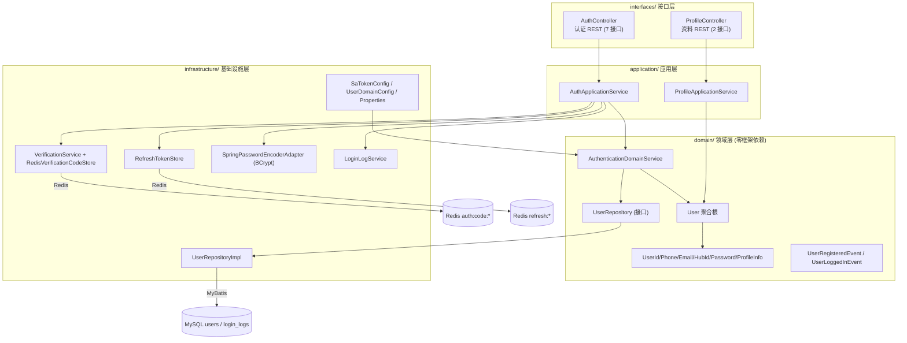
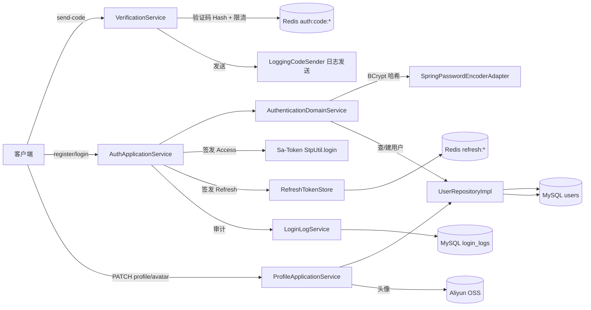
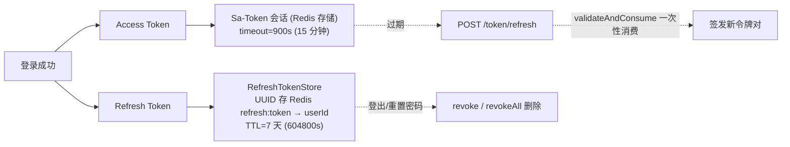

## 1. 模块是什么

User 模块是知识分享社区的**用户账户与认证子系统**，负责：用户注册、登录、令牌管理、验证码、密码重置、个人资料管理与头像上传。

它是整个平台的**入口模块**——所有需要登录的请求都先经过本模块的 Sa-Token 拦截器（`SaTokenConfig`）鉴权，其他模块（content/social/search）通过 `StpUtil.getLoginIdAsLong()` 读取当前用户。

**与旧架构的关系**: AGENTS.md 中曾提到 "Spring Security + OAuth2 Resource Server + JwtService (RSA256)"，当前代码已迁移为 **Sa-Token + Redis**（JwtService 已删除，pom 中无 Spring Security Web 依赖，仅保留 `spring-security-crypto` 用于 BCrypt）。本模块以**实际代码为准**讲解。

## 2. 核心职责

| 子系统                | 职责                                                   | 核心类                                                   |
| --------------------- | ------------------------------------------------------ | -------------------------------------------------------- |
| 认证 (Auth)           | 注册/登录/刷新令牌/登出/重置密码/查询我                | `AuthApplicationService` + `AuthenticationDomainService` |
| 验证码 (Verification) | 验证码生成/存储/校验/限流                              | `VerificationService` + `RedisVerificationCodeStore`     |
| 令牌 (Token)          | Access Token (Sa-Token) + Refresh Token (Redis 白名单) | `RefreshTokenStore`                                      |
| 资料 (Profile)        | 个人资料 PATCH 更新、头像上传                          | `ProfileApplicationService`                              |
| 审计 (Audit)          | 注册/登录成功与失败日志                                | `LoginLogService`                                        |

## 3. DDD 四层架构



**依赖方向**: interfaces → application → domain ← infrastructure。领域层只依赖 `Password.PasswordEncoder` 接口与 `UserRepository` 接口，密码编码器通过 `SpringPasswordEncoderAdapter` 适配 BCrypt，保持 domain 零框架依赖。

## 4. 文件清单与职责

### interfaces/ 接口层 (14 个文件)

| 文件                                                    | 职责                                                          |
| ------------------------------------------------------- | ------------------------------------------------------------- |
| `rest/AuthController.java`                              | 认证 REST 控制器 (7 接口 + IP/UA 解析)                        |
| `rest/ProfileController.java`                           | 资料 REST 控制器 (PATCH + 头像上传)                           |
| `dto/RegisterRequest.java`                              | 注册请求 (identifierType/identifier/code/password/agreeTerms) |
| `dto/LoginRequest.java`                                 | 登录请求 (identifierType/identifier/code/password)            |
| `dto/SendCodeRequest.java` / `SendCodeResponse.java`    | 发送验证码请求/响应                                           |
| `dto/TokenRefreshRequest.java` / `TokenResponse.java`   | 刷新令牌请求 / 令牌对响应                                     |
| `dto/AuthResponse.java` / `AuthUserResponse.java`       | 认证组合响应 / 用户信息                                       |
| `dto/LogoutRequest.java` / `PasswordResetRequest.java`  | 登出 / 重置密码请求                                           |
| `dto/ProfilePatchRequest.java` / `ProfileResponse.java` | 资料 PATCH 请求 / 资料响应                                    |

### application/ 应用层 (2 个文件)

| 文件                                     | 职责                                                                   |
| ---------------------------------------- | ---------------------------------------------------------------------- |
| `service/AuthApplicationService.java`    | 认证用例编排 (sendCode/register/login/refresh/logout/resetPassword/me) |
| `service/ProfileApplicationService.java` | 资料用例编排 (updateProfile/updateAvatar)                              |

### domain/ 领域层 (10 个文件)

| 文件                                                              | 职责                                                                            |
| ----------------------------------------------------------------- | ------------------------------------------------------------------------------- |
| `service/AuthenticationDomainService.java`                        | 注册/登录领域逻辑 + 手动事件监听器                                              |
| `model/aggregate/User.java`                                       | 用户聚合根 (register/reconstitute/updateProfile/updatePassword/passwordMatches) |
| `repository/UserRepository.java`                                  | 用户仓储接口 (12 方法)                                                          |
| `model/valueobject/UserId.java`                                   | 用户 ID                                                                         |
| `model/valueobject/Phone.java`                                    | 手机号 (正则校验)                                                               |
| `model/valueobject/Email.java`                                    | 邮箱 (正则校验)                                                                 |
| `model/valueobject/HubId.java`                                    | 知光号 (4-64 字符)                                                              |
| `model/valueobject/Password.java`                                 | 密码哈希 + PasswordEncoder 接口                                                 |
| `model/valueobject/ProfileInfo.java`                              | 资料值对象 (merge/empty)                                                        |
| `model/valueobject/ClientInfo.java` / `IdentifierType.java`       | 客户端信息 / 标识类型枚举                                                       |
| `event/UserRegisteredEvent.java` / `event/UserLoggedInEvent.java` | 领域事件                                                                        |

### infrastructure/ 基础设施层 (15 个文件)

| 目录                      | 文件                                                            | 职责                                  |
| ------------------------- | --------------------------------------------------------------- | ------------------------------------- |
| `config/`                 | `SaTokenConfig.java`                                            | 全局鉴权拦截器 + CORS + 属性绑定      |
| `config/`                 | `UserDomainConfig.java`                                         | 装配 AuthenticationDomainService Bean |
| `config/`                 | `PasswordProperties.java`                                       | 密码策略 (auth.password.minLength=8)  |
| `config/`                 | `VerificationProperties.java`                                   | 验证码策略 (auth.verification.*)      |
| `security/`               | `RefreshTokenStore.java`                                        | Refresh Token 白名单 (Redis, UUID)    |
| `persistence/repository/` | `UserRepositoryImpl.java`                                       | 用户仓储实现 (领域↔PO 转换)           |
| `persistence/repository/` | `LoginLogService.java`                                          | 登录审计记录                          |
| `persistence/repository/` | `SpringPasswordEncoderAdapter.java`                             | BCrypt 适配 Password.PasswordEncoder  |
| `persistence/PO/`         | `UserPO.java` / `LoginLogEntity.java`                           | 持久化对象                            |
| `persistence/mapper/`     | `UserMapper.java` / `LoginLogMapper.java`                       | MyBatis Mapper                        |
| `verification/`           | `VerificationService.java`                                      | 验证码发送/校验/限流                  |
| `verification/`           | `RedisVerificationCodeStore.java`                               | 验证码 Redis Hash 存储                |
| `verification/`           | `IdentifierValidator.java`                                      | 手机号/邮箱格式校验工具               |
| `verification/`           | `CodeSender.java` / `LoggingCodeSender.java`                    | 发送器接口 + 日志实现                 |
| `verification/`           | `VerificationScene/Status/CheckResult/SendCodeResult/CodeStore` | 验证码领域模型                        |

## 5. 请求路由总表

### AuthController — 认证 (7 个, 前缀 `/api/v1/auth`)

| #   | 方法 | 路径              | 需要登录 | 说明                      |
| --- | ---- | ----------------- | -------- | ------------------------- |
| 1   | POST | `/send-code`      | ❌       | 发送验证码                |
| 2   | POST | `/register`       | ❌       | 注册并自动登录            |
| 3   | POST | `/login`          | ❌       | 登录 (密码/验证码)        |
| 4   | POST | `/token/refresh`  | ❌       | 刷新令牌对                |
| 5   | POST | `/logout`         | ❌       | 登出 (撤销 Refresh Token) |
| 6   | POST | `/password/reset` | ❌       | 验证码重置密码            |
| 7   | GET  | `/me`             | ✅       | 查询当前用户              |

### ProfileController — 资料 (2 个, 前缀 `/api/v1/profile`)

| #   | 方法  | 路径                     | 需要登录 | 说明                 |
| --- | ----- | ------------------------ | -------- | -------------------- |
| 8   | PATCH | `/api/v1/profile`        | ✅       | 部分更新个人资料     |
| 9   | POST  | `/api/v1/profile/avatar` | ✅       | 上传头像 (multipart) |

### Sa-Token 拦截器放行名单 (`SaTokenConfig.java:19-36`)

```text
/api/v1/auth/send-code, /register, /login, /token/refresh, /logout, /password/reset
/api/v1/knowposts/feed, /api/v1/knowposts/detail/*, /api/v1/knowposts/*/qa/stream
/api/v1/search/suggest
/api/v1/counter/*
/api/v1/relation/following, /api/v1/relation/followers, /api/v1/relation/counter
/actuator/health, /actuator/info
```

其余所有路径 (`/**`) 都需要登录 —— 由 `SaInterceptor(handle -> StpUtil.checkLogin())` 拦截。

## 6. 核心架构图

### 6.1 认证流程总览



### 6.2 双令牌机制



## 7. 存储与安全全景

### MySQL 表 (2 张)

| 表           | 用途     | 关键字段/索引                                        |
| ------------ | -------- | ---------------------------------------------------- |
| `users`      | 用户主表 | `phone` UK, `email` UK, `hub_id` UK, `password_hash` |
| `login_logs` | 登录审计 | `(user_id, created_at)` 索引                         |

### Redis 结构 (3 类)

| Key 模式                                      | 类型   | 用途                                          | TTL            |
| --------------------------------------------- | ------ | --------------------------------------------- | -------------- |
| `auth:code:{scene}:{identifier}`              | Hash   | 验证码 {code, maxAttempts, attempts}          | 5 分钟         |
| `auth:code:last:{scene}:{identifier}`         | String | 发送间隔门闩                                  | 60 秒          |
| `auth:code:count:{scene}:{identifier}:{date}` | String | 每日限额计数                                  | 1 天           |
| `refresh:{token}`                             | String | Refresh Token 白名单 (value=userId)           | 7 天           |
| `refresh:uid:{userId}`                        | ZSet   | 按用户令牌索引 (member=token, score=过期时间) | 随 member 滚动 |

### Sa-Token 会话存储 (Redis)

| Key 模式                      | 用途                           |
| ----------------------------- | ------------------------------ |
| `satoken:login:token:{token}` | Access Token → 登录态 (userId) |

### 认证安全组件

| 组件          | 技术                                 | 用途                                        |
| ------------- | ------------------------------------ | ------------------------------------------- |
| Access Token  | Sa-Token (JWT 格式, sa-token-jwt)    | 15 分钟有效，Redis 校验                     |
| Refresh Token | UUID + Redis 白名单 + 用户 ZSet 索引 | 7 天有效，一次性消费 (旋转)；revokeAll O(K) |
| 密码哈希      | BCrypt (`BCryptPasswordEncoder`)     | 不可逆，含随机盐                            |
| 验证码        | SecureRandom 数字 + Redis Hash       | 5 分钟有效，5 次尝试上限                    |

## 8. 关键设计思想

1. **验证码三重防护**：发送间隔 (60s) + 每日限额 (10 次) + 尝试次数上限 (5 次)，全部基于 Redis 原子操作
2. **双令牌分离**：短生命周期 Access Token (15 分钟) + 长生命周期可撤销 Refresh Token (7 天, 一次性旋转)，兼顾安全与体验
3. **刷新令牌旋转**：`validateAndConsume` 先读后删，防止重放；刷新后旧令牌立即失效
4. **密码永不落明文**：领域层只存哈希，BCrypt 通过 `Password.PasswordEncoder` 接口适配注入，domain 零依赖
5. **注册即登录**：注册成功直接 `StpUtil.login`，无需二次登录；可选无密码注册（仅验证码登录）
6. **审计日志**：注册/登录成功与失败都写 `login_logs`（含 IP/UA），便于安全排查
7. **越权防护**：资料更新通过 `StpUtil.getLoginIdAsLong()` 取当前用户，不信任前端传 userId
8. **领域事件解耦**：注册/登录通过手动 `Consumer` 监听器，与 social/content 的领域事件模式一致

---

> 下一篇: [01-接口层与请求详解](01-接口层与请求详解.md) — 9 个接口逐一拆解
