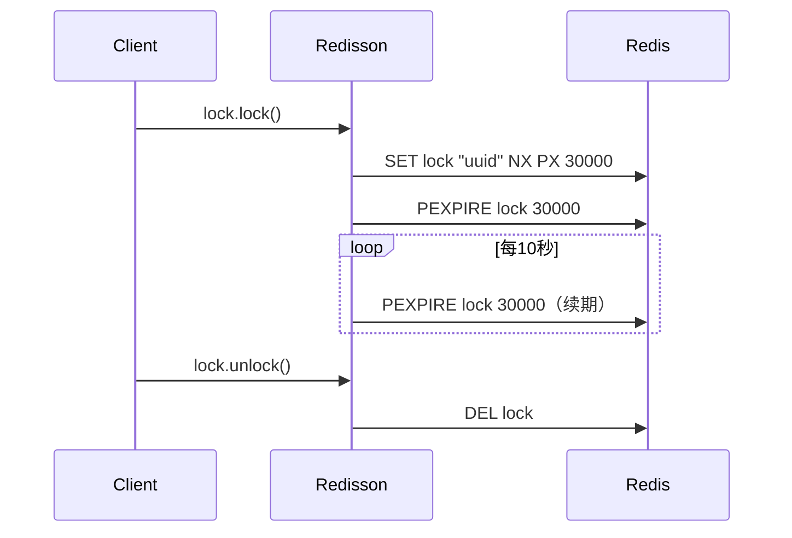

# Redisson 分布式锁

---

## 一、概述

Redisson 提供了 Java 界最完善的分布式锁实现。核心特点：

- **自动续期（看门狗 Watchdog）**：默认每 10 秒续期一次，续到 30 秒
- **可重入**：同一个线程可以多次获取同一把锁
- **阻塞或非阻塞**：支持 `tryLock`、`lock`、`lockInterruptibly`
- **多种锁类型**：可重入锁、读写锁、信号量、闭锁、公平锁等

---

## 二、基础锁 RLock

### 2.1 基本用法

```java
@Autowired
private RedissonClient redisson;

public void doSomething() {
    RLock lock = redisson.getLock("myLock");
    try {
        // 1. 阻塞等待（默认锁过期时间 30 秒，看门狗自动续期）
        lock.lock();

        // 2. 带超时的等待（30秒获取不到就放弃）
        // boolean acquired = lock.tryLock(10, TimeUnit.SECONDS);
        // if (!acquired) {
        //     throw new RuntimeException("获取锁超时");
        // }

        // 业务逻辑
        System.out.println("执行业务...");
    } finally {
        // 确保释放锁
        lock.unlock();
    }
}
```

### 2.2 看门狗（Watchdog）机制

```java
// 默认行为：lock() 没有自定义过期时间时会启动看门狗
lock.lock();  // 默认过期 30s，看门狗每 10s 续期一次

// 自定义过期时间时，看门狗不会启动
lock.lock(10, TimeUnit.SECONDS);  // 10 秒后自动过期，不会续期

// tryLock 也一样
lock.tryLock(10, 30, TimeUnit.SECONDS);
// 参数1: 等待超时（获取锁的最大等待时间）
// 参数2: 锁的持有时间（超过后自动释放，不会触发看门狗）
```

**看门狗原理：**



### 2.3 可重入

```java
RLock lock = redisson.getLock("myLock");

lock.lock();  // 第一次获取锁
try {
    // ... 业务
    lock.lock();  // 第二次获取锁（同一个线程，成功）
    try {
        // ... 更深层业务
    } finally {
        lock.unlock();  // 释放第二次
    }
} finally {
    lock.unlock();  // 释放第一次
}
```

---

## 三、公平锁 RFairLock

保证等待时间最长的线程优先获取锁。

```java
RFairLock fairLock = redisson.getFairLock("fairLock");
fairLock.lock();
try {
    // 业务逻辑
} finally {
    fairLock.unlock();
}
```

**适用场景**：资源分配需要遵循先来后到的场景（如任务调度、票务系统）。

---

## 四、读写锁 RReadWriteLock

```java
RReadWriteLock rwLock = redisson.getReadWriteLock("docLock");
RLock readLock = rwLock.readLock();
RLock writeLock = rwLock.writeLock();

// 读锁——可多个线程同时读
readLock.lock();
try {
    // 读取操作（多个线程可以同时持有读锁）
} finally {
    readLock.unlock();
}

// 写锁——独占
writeLock.lock();
try {
    // 写入操作（持有写锁时，读写锁都会被阻塞）
} finally {
    writeLock.unlock();
}
```

**规则：**

- 读 + 读：✅ 允许
- 读 + 写：❌ 阻塞
- 写 + 写：❌ 阻塞

**适用场景**：读多写少的共享资源（如配置中心、商品详情）。

---

## 五、信号量 RSemaphore 和 RPermitExpirableSemaphore

### RSemaphore（限制并发数）

```java
RSemaphore semaphore = redisson.getSemaphore("mySemaphore");

// 初始化 3 个许可
semaphore.trySetPermits(3);

// 获取许可（阻塞）
semaphore.acquire();

// 尝试获取许可（非阻塞）
boolean acquired = semaphore.tryAcquire();

// 释放许可
semaphore.release();
```

### RPermitExpirableSemaphore（带过期的许可）

```java
RPermitExpirableSemaphore semaphore = redisson.getPermitExpirableSemaphore("limited");
semaphore.trySetPermits(3);

// 获取许可并自动过期
String permitId = semaphore.acquire(10, TimeUnit.SECONDS);

// 使用许可证
// ...

// 释放
semaphore.release(permitId);
```

**适用场景**：控制并发访问资源数量，如数据库连接池、API 限流。

---

## 六、闭锁 RCountDownLatch

跨机器的 CountDownLatch：

```java
RCountDownLatch latch = redisson.getCountDownLatch("taskLatch");

// 主线程：设置总任务数并等待
latch.trySetCount(5);
latch.await();  // 等待计数器归零

// 工作线程（可能在另一台机器上）：
RCountDownLatch latch = redisson.getCountDownLatch("taskLatch");
latch.countDown();  // 计数减1
```

**适用场景**：分布式任务完成后统一汇总、分布式系统启动等待。

---

## 七、Spring Boot AOP 注解式锁

添加自定义注解简化使用：

```java
@Target(ElementType.METHOD)
@Retention(RetentionPolicy.RUNTIME)
public @interface DistributedLock {
    String key();
    long waitTime() default 10;
    long leaseTime() default 30;
    TimeUnit timeUnit() default TimeUnit.SECONDS;
}
```

```java
@Aspect
@Component
public class DistributedLockAspect {

    @Autowired
    private RedissonClient redisson;

    @Around("@annotation(lock)")
    public Object around(ProceedingJoinPoint joinPoint, DistributedLock lock) throws Throwable {
        String lockKey = lock.key();
        RLock rLock = redisson.getLock(lockKey);

        boolean acquired = rLock.tryLock(lock.waitTime(), lock.leaseTime(), lock.timeUnit());
        if (!acquired) {
            throw new RuntimeException("获取锁失败: " + lockKey);
        }

        try {
            return joinPoint.proceed();
        } finally {
            if (rLock.isHeldByCurrentThread()) {
                rLock.unlock();
            }
        }
    }
}
```

```java
@Service
public class OrderService {

    @DistributedLock(key = "lock:order:pay", waitTime = 5)
    public void payOrder(Long orderId) {
        // 分布式锁保护下的业务逻辑
    }
}
```

---

## 八、锁对比总结

| 锁类型         | 类名                        | 可重入 | 阻塞 | 特点                   |
| -------------- | --------------------------- | ------ | ---- | ---------------------- |
| **可重入锁**   | `RLock`                     | ✅     | ✅   | 最常用，看门狗自动续期 |
| **公平锁**     | `RFairLock`                 | ✅     | ✅   | 先来先得               |
| **读写锁**     | `RReadWriteLock`            | ✅     | ✅   | 读读共享、读写互斥     |
| **信号量**     | `RSemaphore`                | ❌     | ✅   | 控制并发数             |
| **过期信号量** | `RPermitExpirableSemaphore` | ❌     | ✅   | 许可自动过期           |
| **闭锁**       | `RCountDownLatch`           | ❌     | ✅   | 多任务同步             |

---

## 九、最佳实践

1. **统一锁前缀**：统一命名如 `lock:业务名:资源ID`
2. **设置合理超时**：避免死锁；除非必要，否则交给看门狗控制
3. **finally 释放**：一定在 finally 块中释放
4. **粒度最小化**：锁的范围尽量小，避免影响性能
5. **监控告警**：锁等待超时时告警，排查是否是死锁或长事务
6. **避免大的操作**：持有锁期间不要执行耗时的 I/O 操作
7. **与事务一致性**：锁释放前先提交事务，避免数据不一致
