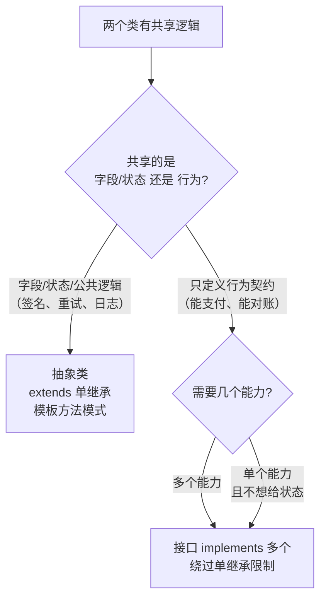

# 接口和抽象类到底怎么选？被一段"抽象类硬装接口"的代码坑过以后

## 先说那次 code review 事故

组里一个支付渠道服务，`WechatPayChannel` 要接入新的对账能力。我看了一眼父类：

```java
// 错误示范：把"能力"做成了继承
public abstract class PayChannel {
    public abstract void pay(BigDecimal amount);   // 抽象方法，没问题
    protected String channelName;                   // 抽象类可以持有字段
    // ...支付逻辑都堆在这
}

public class WechatPayChannel extends PayChannel {
    // 对账能力也想加进来 → 只能往 PayChannel 里塞
    // 可 AlipayChannel、BankChannel 根本不需要对账，凭什么继承它？
}
```

结果你猜怎么着？对账逻辑被塞进抽象类，子类用不用的都得继承，`channelName` 这种状态还被两个子类共享，改一个全跟着变。等我接手想重构，发现 `PayChannel` 单继承的位置已经被占了，想再给它加个"可对账"的接口能力，类结构已经拧成一团——**头皮发麻**。

这就是面试官爱问这道题的原因：**分不清"抽象类"和"接口"的人，写出来的类层级全是这种定时炸弹。**

## 面试官考这道题，到底想看什么？

> 出现频率：**Java 基础必考三连**（`==`/equals、接口 vs 抽象类、String 系列），十场面试至少出现六场。
> 及格线：**语法差异全部答对 + 能说出"Java 是单继承"这个约束**。这俩答不出，直接凉。

## 及格回答 vs 高分回答

**及格回答**（背出来的）：

> "抽象类可以有具体方法，接口都是抽象方法；抽象类用 extends 单继承，接口用 implements 能实现多个；抽象类有构造器，接口没有；接口的字段都是常量……"

语法没错，但面试官听完面无表情——**这是背的，不是理解的**。

**高分回答**（讲出来的）：

> "语法层面：抽象类是'类'，有字段、构造器、protected 方法，用 extends 单继承；接口是'契约'，方法默认 public abstract，Java 8 后才有 default/static 方法，Java 9 后才有 private 方法。但真正的区别是语义：**抽象类描述 is-a（它是什么），负责抽取公共状态和模板逻辑；接口描述 can-do（它能做什么），负责定义能力和解耦**。选型时：要复用状态/走模板方法 → 抽象类；要定义契约、绕过单继承限制、实现多种能力 → 接口。"

区别就一条：**及格的人在背语法，高分的人在讲设计意图。** 这道题后续的追问，全是从"语义"这条线展开的。

## 核心区别：为什么需要它俩

先想清楚一个问题：**Java 为什么要同时提供这两个东西？**

- **单继承限制**：一个类只能 `extends` 一个父类。如果"能力"都靠继承，一个类同时要"能支付 + 能对账 + 能退款"，继承树直接炸。接口可以 `implements` 多个，这是接口存在的根本原因。
- **状态与模板**：多个类共享同一批字段和公共逻辑（比如支付的签名、日志、重试），这些必须有个地方统一放。接口放不了状态，抽象类可以——模板方法模式就长在抽象类上。



## 语法层面对比（背也要背全）

| 维度       | 抽象类 `abstract class`                      | 接口 `interface`                                           |
| ---------- | -------------------------------------------- | ---------------------------------------------------------- |
| 实例化     | 不能 new，但**有构造器**（子类初始化链要用） | 不能 new，无构造器                                         |
| 字段       | 可以有实例字段，任意访问级别                 | 只能是 `public static final` 常量（隐式）                  |
| 普通方法   | 可以有具体实现                               | Java 8 前没有；8 后有 `default`/`static`，9 后有 `private` |
| 抽象方法   | 可以混合：部分抽象、部分具体                 | 默认全部 `public abstract`                                 |
| 访问修饰符 | 任意（private/protected 都行）               | 方法默认 `public`，Java 9 前不能降级                       |
| 继承方式   | `extends` **单继承**                         | `implements` **多实现**；接口还能多继承接口                |
| 语义       | **is-a**：它是什么                           | **can-do**：它能做什么                                     |

几个容易被抠的细节：

```java
// 抽象类的构造器不能是 private —— 子类构造器隐式调用 super()，
// private 就调用不了，编译直接报错
public abstract class PayChannel {
    protected String channelName;              // 字段：接口给不了的
    public PayChannel(String name) {           // 构造器：接口没有
        this.channelName = name;
    }
    public void preCheck() {                   // 具体方法：模板方法的骨架
        System.out.println("校验渠道参数...");   // 所有子类共用的公共逻辑
    }
    public abstract void pay(BigDecimal amount); // 留给子类各自实现
}

// 接口：只定义能力，不携带任何状态
public interface Refundable {
    void refund(String orderNo);   // 默认 public abstract，写不写都一样
    default void log() {           // Java 8 default：给"增强接口"留后路
        System.out.println("退款日志");
    }
}
```

> 记忆锚点：**抽象类像一个"不完整的类"，接口像一个"能力合同"。** 字段和构造器是区分二者的试金石。

## 怎么用：两个经典场景

**场景一：模板方法 → 抽象类。** 支付流程谁来做骨架，谁就继承。

```java
public abstract class AbstractPayChannel {
    public final void pay(BigDecimal amount) {
        sign();              // 1. 签名（公共）
        validate(amount);    // 2. 校验（抽象，子类实现）
        doPay(amount);       // 3. 真正扣款（抽象，子类实现）
        log();               // 4. 日志（公共）
    }
    protected abstract void validate(BigDecimal amount);
    protected abstract void doPay(BigDecimal amount);
    // sign/log 已在父类实现，子类只管业务差异
}
```

**场景二：能力组合 → 接口。** 支付渠道千变万化，能力是排列组合：

```java
// 一个渠道类可以同时具备多种能力，继承做不到，接口可以
public class WechatPayChannel extends AbstractPayChannel
        implements Refundable, Queryable {
    @Override
    protected void doPay(BigDecimal amount) { /* 微信扣款 */ }
    @Override
    public void refund(String orderNo) { /* 微信退款 */ }
}
```

## 最大的坑：Java 8 之后，抽象类是不是没用了？

面试最容易在这里翻车。Java 8 给接口加了 `default` 方法，很多人脱口而出"抽象类要被接口取代了"——**这是误解**。

`default` 方法解决的是**接口演进**问题（老接口加新方法，实现类不用全改），不是让你把业务逻辑写进接口。它改变不了两个硬事实：

1. **接口没有状态。** 没有实例字段，`default` 方法想缓存点东西都没地方放。
2. **接口方法全公开。** 没有 protected 这种中间地带，实现细节藏不住。

真正的坑在**菱形冲突**：两个接口都有同名 `default` 方法，一个类同时实现它俩：

```java
public interface A {
    default void run() { System.out.println("A"); }
}
public interface B {
    default void run() { System.out.println("B"); }
}
public class C implements A, B {
    // 编译报错：C 必须重写 run()，否则编译器不知道听谁的
    @Override
    public void run() { A.super.run(); }   // 显式指定调 A 的，才算解决
}
```

> 面试加分句：**"Java 8 让接口和抽象类在语法上界限模糊，但语义上永远清晰：接口无状态、全公开，定位是契约；抽象类有状态、有保护级别，定位是复用。选型永远先问状态和访问控制，再问语法。"**

## 三个连环追问 + 应答要点

**追问 1：接口的字段为什么必须是 `public static final`？**

> 接口不能实例化，就没有"实例字段"的概念；字段只能是常量，`public static final` 是编译器隐式补的，写不写都是它。加分点：所以接口本质上"不存储任何状态"，这也反向解释了为什么共享状态必须靠抽象类。

**追问 2：一个类能同时继承抽象类和实现接口吗？能，但顺序有没有讲究？**

> 可以，`extends` 在前、`implements` 在后：`class C extends AbstractA implements I1, I2`。要点：**继承是"是什么"，实现是"能做什么"，两者不冲突；但继承只有一个名额，接口不占名额。** 引申一句"所以能用接口就别用继承，给子类留扩展余地"，直接加分。

**追问 3：既然抽象类有构造器，它能被直接 new 吗？构造器有什么用？**

> 不能 new，但构造器必须存在：子类实例化时先走父类构造器完成状态初始化。追问到这里再补一句模板方法模式的本质（父类定骨架、子类填差异），就是完整的高分答案。

## 【高分回答速记表】

| 必答（及格线）                                        | 加分（进决赛）                               | 避雷（说错即减分）                                      |
| ----------------------------------------------------- | -------------------------------------------- | ------------------------------------------------------- |
| 抽象类有具体方法/字段/构造器，接口（Java 8 前）全抽象 | 上升到语义：is-a vs can-do，举例说明         | 说"接口没有方法实现"——Java 8 之后有 default/static 方法 |
| extends 单继承、implements 多实现                     | 点出单继承限制是接口存在的根本原因           | 说"接口能继承类"——接口只能继承接口                      |
| 接口字段是 public static final 常量                   | 模板方法模式 → 抽象类；能力组合 → 接口       | 说"抽象类不能被继承"（反了，它就是拿来继承的）          |
| 接口没有构造器，抽象类有                              | 能讲清 default 方法的菱形冲突和解决方式      | 说"抽象类构造器可以是 private"（编译都过不去）          |
| 抽象类不能实例化                                      | 说出"Java 9 接口还能有 private 方法"的演进线 | 用"接口 1.0 时代"的规则回答 Java 17 的题                |

## 一句话答题策略 + 速查清单

> **一句话策略："语法说差异（字段/构造器/继承方式），语义说定位（is-a 复用 vs can-do 契约），结尾抛决策准则（要状态和模板 → 抽象类；要解耦和组合能力 → 接口）。"** 三段递进，全程无废话。

面试前自查一遍：

- [ ] 能说出抽象类的字段/构造器/protected 方法，接口给不了
- [ ] 知道接口字段隐式是 `public static final`
- [ ] 能解释 Java 8 default/static、Java 9 private 方法的演进动机（接口演进）
- [ ] 能说出"单继承限制"是接口存在的根本原因
- [ ] 能讲模板方法模式（抽象类）和策略/能力组合（接口）各举一个例子
- [ ] 知道同名 default 方法的菱形冲突必须重写解决
- [ ] 能给出选型决策：有共享状态/公共逻辑 → 抽象类；纯契约/多能力 → 接口
- [ ] 收尾能抛出一句设计原则（如"优先组合而非继承"）
