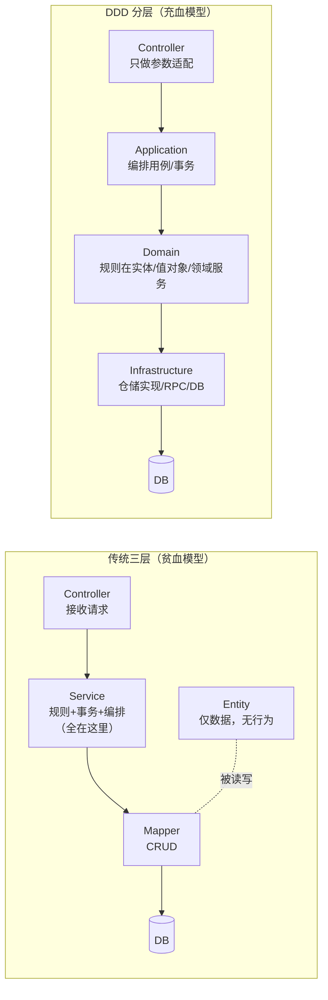
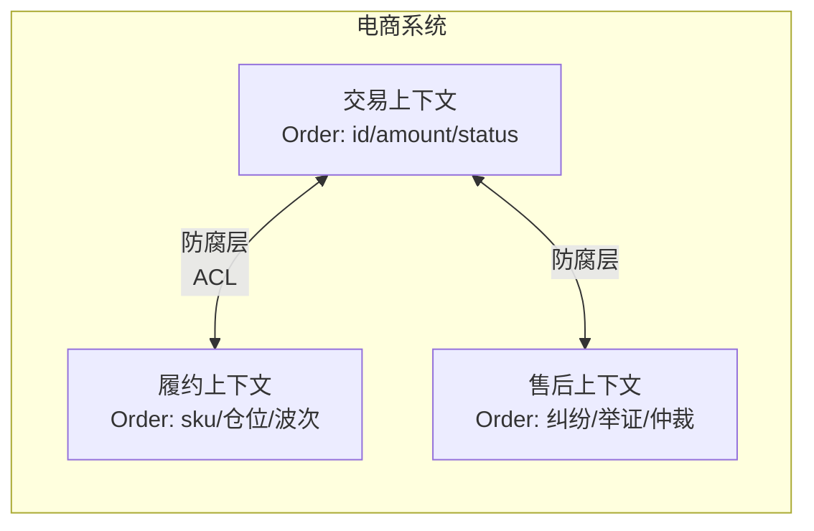
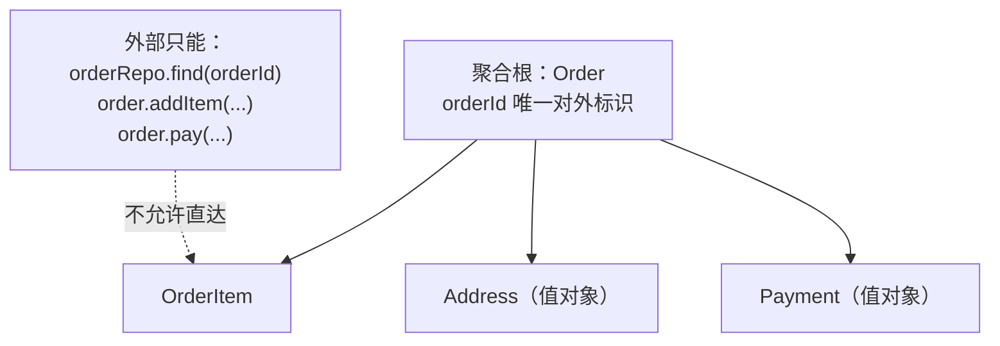
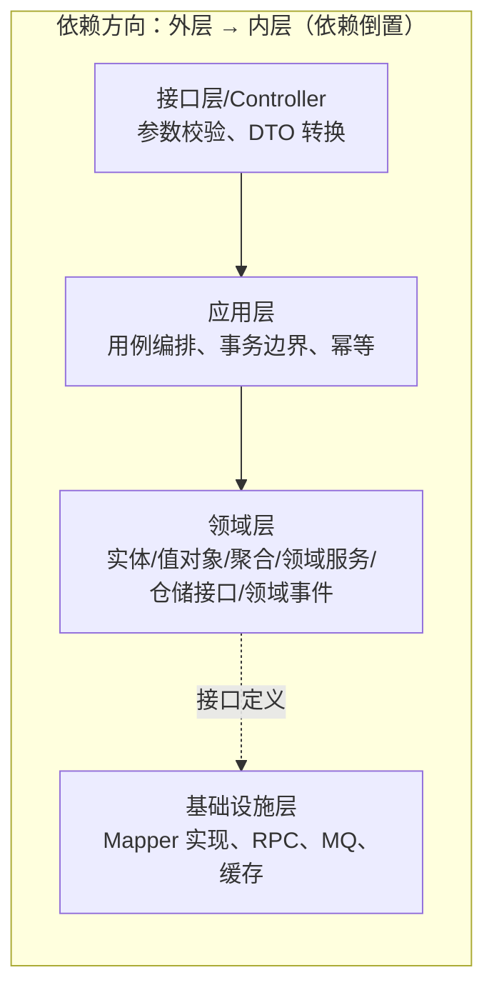
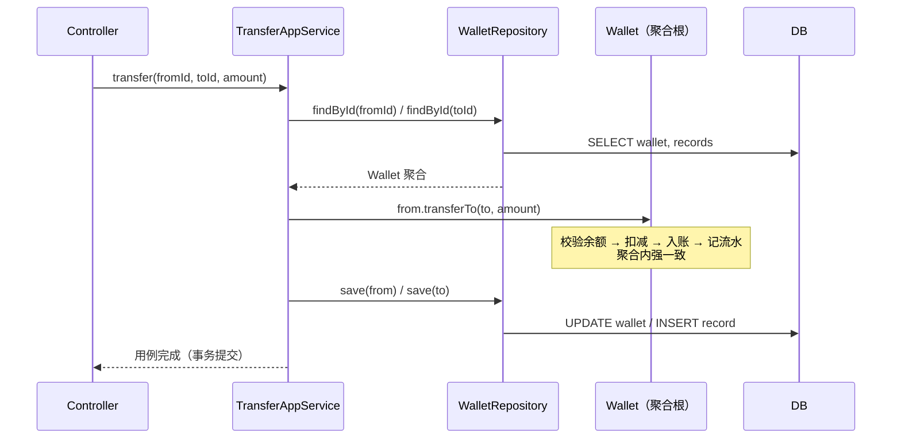
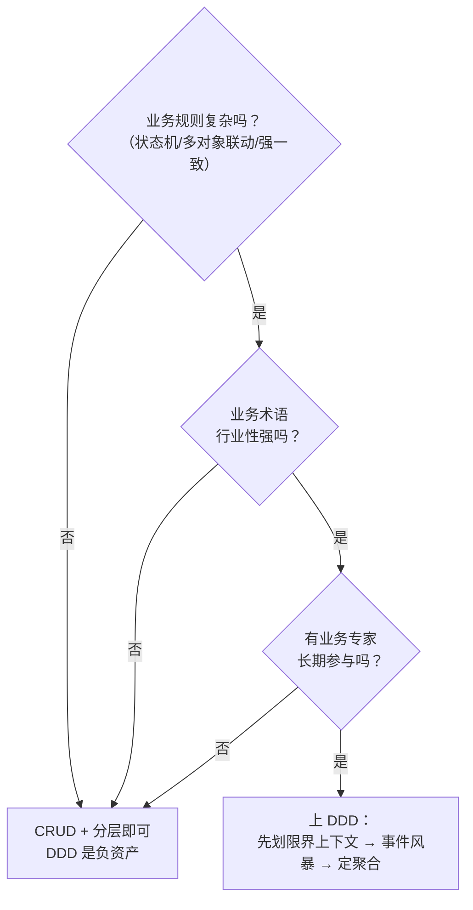

# 面试被问到 DDD，怎么讲才不像背课文？

## 先说个让我头皮发麻的事

朋友第一家公司接了个"金融系统改造"项目，技术总监大手一挥：上 DDD！结果三个月后代码库长这样：

- 每个 Service 依然几百上千行，事务、校验、状态流转全写在里面
- 新增一个 20 行的接口，要改 6 个文件、5 层目录
- 领域对象清一色 getter/setter，业务逻辑全在外面

说白了，我们只是把 Controller → Service → Mapper 换了个马甲叫"应用层 → 领域层"，骨子里还是那套 MVC + 贫血模型。**DDD 不是一套分层模板，它解决的是"业务逻辑该放哪、边界怎么划"的问题，而这个问题，恰恰是面试官最想听你讲清楚的。**

面试官问 DDD，90% 的意图不是让你背战术模式清单，而是想看两件事：

1. 你知不知道**代码烂在哪儿**（业务逻辑散落、没人能说清系统的业务规则）
2. 你有没有能力**用一套方法论把业务边界和代码边界对齐**

## 为什么会出现 DDD？—— 从"代码腐化"说起

先看传统三层架构（Controller/Service/Mapper）在复杂业务下是怎么烂的。

```java
// 传统写法：订单状态流转直接写在 Service 里
@Service
public class OrderService {

    @Transactional
    public void pay(Long orderId, Long userId, BigDecimal amount) {
        Order order = orderMapper.selectById(orderId);

        // 校验和状态流转全在这坨 if 里
        if (order.getStatus() != 1) {
            throw new BizException("订单不可支付");
        }
        if (amount.compareTo(order.getAmount()) != 0) {
            throw new BizException("金额不一致");
        }

        order.setStatus(2);          // 状态推进
        order.setPayTime(LocalDateTime.now());
        orderMapper.updateById(order);

        // 调库存服务扣减
        stockClient.deduct(order.getItems());
        // 发消息
        mqTemplate.convertAndSend("order.payed", order.getId());
    }
}
```

这段代码的问题一眼能看出来：

| 问题               | 表现                                                            |
| ------------------ | --------------------------------------------------------------- |
| 状态机散落         | `status != 1`、`setStatus(2)` 这种魔法数字散落在各个 Service    |
| 业务规则无处安放   | "金额必须一致""状态才能支付"这些**领域规则**写死在流程代码里    |
| 依赖全部向上层漂移 | Service 既要查库、又要调 RPC、还要发 MQ，改一个逻辑牵一发动全身 |

> 贫血模型的本质：领域对象退化成"数据袋子"，所有业务规则漂到 Service 层，最终 Service 变成又臭又长的"面条代码"。

DDD 的出发点就一句话：**把业务规则放回领域对象自己身上，让代码结构表达业务结构。**



## 一套能讲 5 分钟的核心概念链

面试里别一上来倒豆子报概念。按这条因果链讲，面试官跟着你的思路走，想打断都难：

**领域模型 → 通用语言 → 限界上下文 → 聚合 → 战术组件（实体/值对象/领域服务/仓储）**

### 1. 通用语言（Ubiquitous Language）

业务方说"下单"，研发写 `createOrder()`，测试管它叫"提交订单"——三个人三个词，需求评审各说各话，代码和业务对不上，这就是最大的隐性成本。

**通用语言就是：业务术语与代码里的类名/方法名/字段名强制一致。** 业务说"确认收货"，代码里就必须有 `Order.confirmReceived()`，而不是 `order.status = 5`。

### 2. 限界上下文（Bounded Context）—— 最容易答偏的点

这是整个 DDD 里被误解最深的概念。很多人把它等同于"微服务的边界"，其实不对：

> 限界上下文的本质是**语义边界**：同一个词在不同上下文里含义不同，必须在各自上下文里独立建模，互不污染。

典型的例子：

| 上下文     | "订单"的含义 | 字段示例                     |
| ---------- | ------------ | ---------------------------- |
| 交易上下文 | 一个交易行为 | 订单号、金额、支付状态       |
| 履约上下文 | 一个拣货任务 | 仓位、体积、重量、波次       |
| 售后上下文 | 一个纠纷载体 | 售后类型、举证材料、仲裁状态 |

同一个"订单"，三个上下文里模型完全不一样。硬要统一成一个 `Order` 表，就会出现"一个表 60 个字段、一半字段为别的部门空着"的悲剧。



**防腐层（ACL）**：上下文之间数据要互通，但只交换"对方需要的翻译结果"，不把自己的模型漏过去。比如履约上下文只需要订单的商品明细和地址，交易上下文就只发一个 DTO，绝不让对方看到自己的 `Order` 实体。

### 3. 聚合（Aggregate）—— DDD 的"心脏"

聚合 = **一致性边界**。聚合内多个对象必须保持事务一致，聚合之间只保证最终一致。

这是面试官最爱深挖的点，因为聚合边界划错了，DDD 就直接翻车。划聚合边界的口诀：

1. 事务真正需要强一致的最小集合
2. 通过聚合根访问内部对象，外部不许直接改子对象
3. 对象生命周期一起走（订单删了，订单项没意义）



> 划聚合的终极检验：**如果两个对象不需要同一个本地事务，它们就不该在同一个聚合里。** 一个聚合动辄十个表，基本是划错了。

### 4. 战术组件速查

| 组件            | 是什么                           | 典型特征                            | 反例                             |
| --------------- | -------------------------------- | ----------------------------------- | -------------------------------- |
| 实体 Entity     | 有唯一标识、有生命周期、状态会变 | `Order`、`User`，有 `id` 和业务方法 | 只有 getter/setter               |
| 值对象 VO       | 无标识、不可变、靠属性值相等     | `Money`、`Address`、`Phone`         | 把 `Long money` 裸用，分不清单位 |
| 领域服务        | 不属于任何实体、跨多个对象的规则 | 转账（涉及两个账户）、对账          | 把校验塞进实体                   |
| 仓储 Repository | 聚合的"存取仓库"，接口在领域层   | `OrderRepository.find(id)`          | 在领域层直接调 `orderMapper`     |
| 领域事件        | 聚合内状态变化对外广播           | `OrderPaidEvent`                    | 事件里塞一堆别的上下文的字段     |

### 5. 分层与依赖方向

DDD 经典四层，面试时画这张图就够了：



两个最容易说错的地方：

- **事务开在应用层，不是领域层**。领域层不关心事务，它只保证聚合内规则正确；应用层负责"一次用例 = 一个事务"
- **仓储的接口在领域层，实现在基础设施层**。领域层依赖的是接口，MySQL、Redis、Mongo 只是实现细节，随时可换

## 一个完整用例：钱包转账

把上面所有概念串起来。业务规则：**转账不能超额、余额不足拒绝、转账要记录流水**。

```java
// ========== 领域层 ==========

// 值对象：金额，避免 Long/Double 裸奔
public record Money(BigDecimal amount, Currency currency) {
    public Money subtract(Money other) {
        // 金额运算的规则收在值对象里，谁都不能在外面瞎减
        return new Money(this.amount.subtract(other.amount), currency);
    }
}

// 聚合根：钱包（强一致边界：余额 + 流水）
public class Wallet {

    private final WalletId id;          // 实体标识
    private Money balance;              // 余额是值对象
    private final List<TransferRecord> records = new ArrayList<>();

    public void transferTo(Wallet target, Money amount) {
        // 规则：余额不足直接拒绝 —— 业务规则写在实体里
        if (this.balance.amount().compareTo(amount.amount()) < 0) {
            throw new DomainException("余额不足");
        }
        this.balance = this.balance.subtract(amount);
        target.balance = target.balance.add(amount);
        records.add(new TransferRecord(this.id, target.id, amount, LocalDateTime.now()));
    }
}

// 仓储接口：定义在领域层，实现交给基础设施层
public interface WalletRepository {
    Wallet findById(WalletId id);
    void save(Wallet wallet);
}

// ========== 应用层 ==========

@Service
public class TransferAppService {

    private final WalletRepository repository;  // 注入接口

    @Transactional   // 事务边界在应用层：一次用例一个事务
    public void transfer(WalletId fromId, WalletId toId, Money amount) {
        Wallet from = repository.findById(fromId);
        Wallet to = repository.findById(toId);
        from.transferTo(to, amount);
        repository.save(from);
        repository.save(to);
        // 领域事件这里发布：TransferCompletedEvent，通知对账/审计上下文
    }
}
```

> 核心思想：应用层只说"做什么"（找钱包、转账、保存），领域层决定"怎么做"（余额够不够、怎么记账）。规则永不外溢。

时序图，面试讲这个最直观：



## 什么时候用 DDD，什么时候别用？

这是面试必追问题，也是体现"实战过"的送分题：

| 场景               | 用 DDD                                         | 用传统 CRUD                    |
| ------------------ | ---------------------------------------------- | ------------------------------ |
| 业务规则复杂度     | 状态机多、规则会随业务迭代、多个对象联动强一致 | 增删改查为主，规则稳定简单     |
| 业务术语与代码映射 | 业务方有自己的行业术语（金融/电商/医疗）       | 模型就是表结构，没有"领域"     |
| 变更频率           | 业务策略经常变，要能快速定位规则               | 报表、管理后台、一次性导入导出 |
| 团队认知           | 有业务专家愿意参与建模                         | 外包、需求文档即一切           |
| 系统规模           | 多人协作、上下文间交互复杂                     | 单体小系统，两三个人维护       |

**决策树版**，直接背下来：



> 记住一句可以抛给面试官的话：**"DDD 解决的是业务复杂度的成本，不是技术复杂度的成本。业务简单还上 DDD，等于给自行车装 F1 的刹车。"**

## 最大的坑：把 DDD 当成"分层代码规范"

我见过太多团队（包括我自己带过的）把 DDD 落地成一种仪式：

- 目录按 `domain/application/infrastructure` 劈开，代码却照旧是贫血模型
- 聚合边界拍脑袋划，一个聚合管十个表，事务锁死一片
- 领域事件一上来就对接 MQ + 分布式事务，结果消息乱序、重复消费、状态对不上，比不分还乱

> **DDD 的三个"不是在"**：不是在分层、不是在画 UML、不是在微服务化。它是**建模方法**——先用事件风暴和业务专家对齐模型，再谈代码结构。顺序反了，就是披着 DDD 皮的贫血模型。

另外一个高频率混淆点：**聚合根不是 Service 的马甲**。聚合根是业务规则的主人（`Order.cancel()`），Service 是编排者（一次用例调多个聚合/仓储）。把业务方法全写在 Service 里，聚合根只剩数据——恭喜，你写的是"带分层目录的贫血模型"。

## 面试速查清单

- [ ] 能一句话说出为什么需要 DDD：贫血模型下业务规则散落在 Service，DDD 把规则收回领域对象
- [ ] 能画出四层依赖图并说清**依赖方向**（外层依赖内层接口，实现下沉基础设施层）
- [ ] 能解释限界上下文 = 语义边界 ≠ 微服务边界，举同一个词在不同上下文含义不同的例子
- [ ] 能说清聚合 = 一致性边界 + 聚合根入口，能举"订单 + 订单项"的例子
- [ ] 能区分实体/值对象/领域服务/仓储接口，各举一个例子
- [ ] 知道事务开在应用层、仓储接口定义在领域层、领域事件用于最终一致
- [ ] 能答出"什么时候不用 DDD"：纯 CRUD、无行业术语、无业务专家、小团队单体
- [ ] 有一个自己（或听说过的）落地案例可以讲：用了什么、踩了什么坑

最后送你一句压箱底的：**面试官问你 DDD，他真正想听的不是定义，是你有没有能力判断"这块业务复杂到需要一套方法论来治理"。把"为什么需要"讲清楚，比背二十个概念都值钱。**
